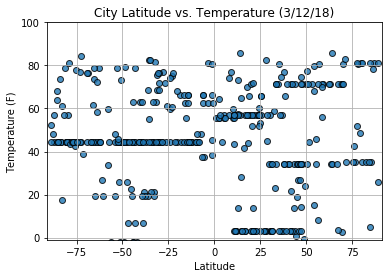
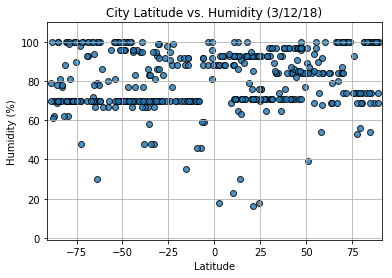
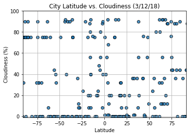
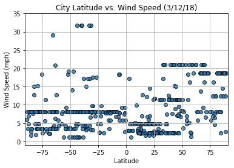

In this example, you'll be creating a Python script to visualize the weather of 500+ cities across the world of varying distance from the equator. To accomplish this, you'll be utilizing a [simple Python library](https://pypi.python.org/pypi/citipy), the [OpenWeatherMap API](https://openweathermap.org/api), and a little common sense to create a representative model of weather across world cities.

Your objective is to build a series of scatter plots to showcase the following relationships:

* Temperature (F) vs. Latitude
* Humidity (%) vs. Latitude
* Cloudiness (%) vs. Latitude
* Wind Speed (mph) vs. Latitude

Your final notebook must:

* Randomly select **at least** 500 unique (non-repeat) cities based on latitude and longitude.
* Perform a weather check on each of the cities using a series of successive API calls. 
* Include a print log of each city as it's being processed with the city number, city name, and requested URL.
* Save both a CSV of all data retrieved and png images for each scatter plot.

As final considerations:

* You must use the Matplotlib libraries.
* You must include a written description of three observable trends based on the data. 
* You must use proper labeling of your plots, including aspects like: Plot Titles (with date of analysis) and Axes Labels.
* You must include an exported markdown version of your Notebook called  `README.md` in your GitHub repository.  
* See [Example Solution](WeatherPy_Example.pdf) for a reference on expected format.


```python
#set dependencies
import json
from pprint import pprint
import requests
from citipy import citipy
from config import api_key
import numpy as np
import pandas as pd
import matplotlib.pyplot as plt
from random import uniform
import itertools
```


```python
# randomly select 500 unique cities using citipy
# There are 4 quadrants - 125 randomized cities per quadrant
# Q1: between 0 and -180 lng, 0 and +90 lat
# Q2: between 0 and +180 lng, 0 and +90 lat
# Q3: between 0 and -180 lng, 0 and -90 lat
# Q4: between 0 and +180 lng, 0 and -90 lat

#change range to 125 when ready!!!
lat_1 = []
lng_1 = []
def lng1():
    return uniform(-180,0)
def lat1():
    return uniform(0,90)

q1_lat = (lat1() for x in range(125))
for coord in q1_lat:
    lat_1.append(coord)
q1_lng = (lng1() for x in range(125))
for coord in q1_lng:
    lng_1.append(coord)

lat_2 = []
lng_2 = []
def lng2():
    return uniform(0,180)
def lat2():
    return uniform(0,90)

q2_lat = (lat2() for x in range(125))
for coord in q2_lat:
    lat_2.append(coord)
q2_lng = (lng2() for x in range(125))
for coord in q2_lng:
    lng_2.append(coord)

lat_3 = []
lng_3 = []
def lng3():
    return uniform(-180,0)
def lat3():
    return uniform(-90,0)

q3_lat = (lat3() for x in range(125))
for coord in q3_lat:
    lat_3.append(coord)
q3_lng = (lng3() for x in range(125))
for coord in q3_lng:
    lng_3.append(coord)
    
lat_4 = []
lng_4 = []
def lng4():
    return uniform(0,180)
def lat4():
    return uniform(-90,0)

q4_lat = (lat4() for x in range(125))
for coord in q4_lat:
    lat_4.append(coord)
q4_lng = (lng4() for x in range(125))
for coord in q4_lng:
    lng_4.append(coord)

print(len(lat_4))
```

    125
    


```python
#find the cities based off of the coordinates
city_name = []
country_abv = []
location = []
latitude = []
longitude = []

#quadrant 1 first
for lat, lng in list(zip(lat_1,lng_1)):
            
    city = citipy.nearest_city(lat, lng)
    city_names = city.city_name
    country_name = city.country_code  
    combined = city_names + ", " + country_name
            
    #append
    location.append(combined)
    city_name.append(city_names)
    country_abv.append(country_name)
    latitude.append(lat)
    longitude.append(lng)

#quadrant 2
for lat, lng in list(zip(lat_2,lng_2)):
            
    city = citipy.nearest_city(lat, lng)
    city_names = city.city_name
    country_name = city.country_code  
    combined = city_names + ", " + country_name
            
    #append
    location.append(combined)
    city_name.append(city_names)
    country_abv.append(country_name)
    latitude.append(lat)
    longitude.append(lng)

#quadrant 3
for lat, lng in list(zip(lat_3,lng_3)):
            
    city = citipy.nearest_city(lat, lng)
    city_names = city.city_name
    country_name = city.country_code  
    combined = city_names + ", " + country_name
            
    #append
    location.append(combined)
    city_name.append(city_names)
    country_abv.append(country_name)
    latitude.append(lat)
    longitude.append(lng)
    
#quadrant 4
for lat, lng in list(zip(lat_4,lng_4)):
            
    city = citipy.nearest_city(lat, lng)
    city_names = city.city_name
    country_name = city.country_code  
    combined = city_names + ", " + country_name
            
    #append
    location.append(combined)
    city_name.append(city_names)
    country_abv.append(country_name)
    latitude.append(lat)
    longitude.append(lng)

print(location)
```

    ['bredasdorp, za', 'port alfred, za', 'port alfred, za', 'port elizabeth, za', 'port elizabeth, za', 'port alfred, za', 'grand river south east, mu', 'albany, au', 'port alfred, za', 'dondo, mz', 'port alfred, za', 'port elizabeth, za', 'bredasdorp, za', 'taolanaro, mg', 'port alfred, za', 'port alfred, za', 'port alfred, za', 'albany, au', 'hermanus, za', 'bredasdorp, za', 'port alfred, za', 'saint-philippe, re', 'taolanaro, mg', 'port elizabeth, za', 'port elizabeth, za', 'mutoko, zw', 'mariental, na', 'bredasdorp, za', 'quatre cocos, mu', 'bredasdorp, za', 'bredasdorp, za', 'saint-philippe, re', 'albany, au', 'saint-pierre, re', 'albany, au', 'port alfred, za', 'bredasdorp, za', 'port elizabeth, za', 'albany, au', 'tsihombe, mg', 'bredasdorp, za', 'sumbe, ao', 'bredasdorp, za', 'hermanus, za', 'taolanaro, mg', 'bredasdorp, za', 'busselton, au', 'cap malheureux, mu', 'port elizabeth, za', 'ambovombe, mg', 'port elizabeth, za', 'taolanaro, mg', 'bengkulu, id', 'tsihombe, mg', 'port elizabeth, za', 'port alfred, za', 'port elizabeth, za', 'bredasdorp, za', 'mahebourg, mu', 'albany, au', 'grootfontein, na', 'souillac, mu', 'victoria, sc', 'bredasdorp, za', 'port alfred, za', 'taolanaro, mg', 'inhambane, mz', 'hithadhoo, mv', 'hermanus, za', 'taolanaro, mg', 'hermanus, za', 'bredasdorp, za', 'port elizabeth, za', 'bredasdorp, za', 'warrenton, za', 'busselton, au', 'busselton, au', 'bredasdorp, za', 'port elizabeth, za', 'opuwo, na', 'port elizabeth, za', 'bredasdorp, za', 'port alfred, za', 'bredasdorp, za', 'port alfred, za', 'bredasdorp, za', 'busselton, au', 'port alfred, za', 'hermanus, za', 'kruisfontein, za', 'hambantota, lk', 'bredasdorp, za', 'hermanus, za', 'busselton, au', 'port alfred, za', 'uige, ao', 'port alfred, za', 'nioki, cd', 'taolanaro, mg', 'port elizabeth, za', 'hermanus, za', 'taolanaro, mg', 'umzimvubu, za', 'port elizabeth, za', 'bredasdorp, za', 'bredasdorp, za', 'bredasdorp, za', 'port alfred, za', 'port elizabeth, za', 'port alfred, za', 'bredasdorp, za', 'port alfred, za', 'taolanaro, mg', 'saint-philippe, re', 'kruisfontein, za', 'saldanha, za', 'saint-leu, re', 'port alfred, za', 'kruisfontein, za', 'bredasdorp, za', 'port elizabeth, za', 'bredasdorp, za', 'busselton, au', 'tsihombe, mg', 'albany, au', 'dikson, ru', 'tawkar, sd', 'longyearbyen, sj', 'dikson, ru', 'ust-tsilma, ru', 'kamenka, ru', 'belushya guba, ru', 'dikson, ru', 'yar-sale, ru', 'belushya guba, ru', 'grong, no', 'longyearbyen, sj', 'belushya guba, ru', 'faya, td', 'shache, cn', 'khabary, ru', 'dikson, ru', 'barentsburg, sj', 'barentsburg, sj', 'mochalishche, ru', 'longyearbyen, sj', 'yuryevets, ru', 'dikson, ru', 'loyga, ru', 'lodwar, ke', 'dikson, ru', 'longyearbyen, sj', 'longyearbyen, sj', 'dikson, ru', 'dikson, ru', 'galbshtadt, ru', 'belyy yar, ru', 'barentsburg, sj', 'katsiveli, ua', 'gat, ly', 'belushya guba, ru', 'dikson, ru', 'kaspiyskiy, ru', 'longyearbyen, sj', 'dikson, ru', 'derzhavinsk, kz', 'longyearbyen, sj', 'longyearbyen, sj', 'longyearbyen, sj', 'dikson, ru', 'bosobolo, cd', 'leshukonskoye, ru', 'longyearbyen, sj', 'alexandria, eg', 'amderma, ru', 'barentsburg, sj', 'faya, td', 'ikot ekpene, ng', 'leshukonskoye, ru', 'longyearbyen, sj', 'belushya guba, ru', 'felanitx, es', 'altay, cn', 'ibra, om', 'kutum, sd', 'longyearbyen, sj', 'dikson, ru', 'longyearbyen, sj', 'dikson, ru', 'dikson, ru', 'dikson, ru', 'barentsburg, sj', 'marawi, sd', 'longyearbyen, sj', 'belushya guba, ru', 'longyearbyen, sj', 'barentsburg, sj', 'dikson, ru', 'barentsburg, sj', 'longyearbyen, sj', 'amderma, ru', 'longyearbyen, sj', 'longyearbyen, sj', 'dikson, ru', 'barentsburg, sj', 'longyearbyen, sj', 'longyearbyen, sj', 'bandar-e lengeh, ir', 'salalah, om', 'dikson, ru', 'ust-kulom, ru', 'galle, lk', 'novosheshminsk, ru', 'amderma, ru', 'belushya guba, ru', 'hobyo, so', 'longyearbyen, sj', 'adrar, dz', 'dikson, ru', 'barentsburg, sj', 'biltine, td', 'longyearbyen, sj', 'dikson, ru', 'longyearbyen, sj', 'belushya guba, ru', 'longyearbyen, sj', 'dikson, ru', 'ostrovnoy, ru', 'kegayli, uz', 'agadez, ne', 'lagdo, cm', 'longyearbyen, sj', 'oksfjord, no', 'longyearbyen, sj', 'sibenik, hr', 'dikson, ru', 'longyearbyen, sj', 'longyearbyen, sj', 'beyneu, kz', 'dikson, ru', 'longyearbyen, sj', 'duvan, ru', 'bereda, so', 'longyearbyen, sj', 'svolvaer, no', 'longyearbyen, sj', 'tumannyy, ru', 'longyearbyen, sj', 'berlevag, no', 'longyearbyen, sj', 'paita, pe', 'ushuaia, ar', 'ushuaia, ar', 'ushuaia, ar', 'georgetown, sh', 'ushuaia, ar', 'ushuaia, ar', 'ushuaia, ar', 'ushuaia, ar', 'ushuaia, ar', 'cape town, za', 'ushuaia, ar', 'cape town, za', 'ushuaia, ar', 'ushuaia, ar', 'maceio, br', 'ushuaia, ar', 'cidreira, br', 'ushuaia, ar', 'ushuaia, ar', 'ushuaia, ar', 'ushuaia, ar', 'ushuaia, ar', 'rawson, ar', 'ushuaia, ar', 'ushuaia, ar', 'axim, gh', 'punta arenas, cl', 'cape town, za', 'ushuaia, ar', 'puerto madryn, ar', 'jamestown, sh', 'ushuaia, ar', 'ushuaia, ar', 'lebu, cl', 'manoel urbano, br', 'ushuaia, ar', 'ushuaia, ar', 'ushuaia, ar', 'chuy, uy', 'jamestown, sh', 'ushuaia, ar', 'ushuaia, ar', 'jamestown, sh', 'ushuaia, ar', 'ushuaia, ar', 'ushuaia, ar', 'arraial do cabo, br', 'jamestown, sh', 'ushuaia, ar', 'ushuaia, ar', 'ushuaia, ar', 'ushuaia, ar', 'lima, pe', 'ushuaia, ar', 'piacabucu, br', 'lebu, cl', 'ushuaia, ar', 'ushuaia, ar', 'ushuaia, ar', 'ushuaia, ar', 'ushuaia, ar', 'ushuaia, ar', 'ushuaia, ar', 'ushuaia, ar', 'ushuaia, ar', 'chivay, pe', 'ushuaia, ar', 'jamestown, sh', 'aquiraz, br', 'ushuaia, ar', 'ushuaia, ar', 'ushuaia, ar', 'ushuaia, ar', 'ushuaia, ar', 'ushuaia, ar', 'ushuaia, ar', 'ushuaia, ar', 'cape town, za', 'ushuaia, ar', 'ushuaia, ar', 'ushuaia, ar', 'manoel urbano, br', 'mercedes, ar', 'coihaique, cl', 'salinas, ec', 'ushuaia, ar', 'ushuaia, ar', 'ushuaia, ar', 'ushuaia, ar', 'ushuaia, ar', 'ushuaia, ar', 'ushuaia, ar', 'ushuaia, ar', 'ushuaia, ar', 'ushuaia, ar', 'ushuaia, ar', 'sao miguel do araguaia, br', 'chimore, bo', 'lebu, cl', 'hualmay, pe', 'puerto leguizamo, co', 'arraial do cabo, br', 'santiago del estero, ar', 'castro, cl', 'ushuaia, ar', 'ushuaia, ar', 'ushuaia, ar', 'ushuaia, ar', 'ushuaia, ar', 'ushuaia, ar', 'ushuaia, ar', 'jamestown, sh', 'ushuaia, ar', 'jamestown, sh', 'ushuaia, ar', 'cape town, za', 'mar del plata, ar', 'ushuaia, ar', 'ushuaia, ar', 'ushuaia, ar', 'ushuaia, ar', 'ushuaia, ar', 'ushuaia, ar', 'arraial do cabo, br', 'sao filipe, cv', 'qaanaaq, gl', 'qaanaaq, gl', 'takoradi, gh', 'barentsburg, sj', 'barentsburg, sj', 'cayenne, gf', 'illoqqortoormiut, gl', 'qaanaaq, gl', 'barentsburg, sj', 'los llanos de aridane, es', 'barentsburg, sj', 'upernavik, gl', 'narsaq, gl', 'cockburn town, bs', 'qaanaaq, gl', 'ribeira grande, pt', 'barentsburg, sj', 'upernavik, gl', 'qaanaaq, gl', 'harper, lr', 'mazagao, br', 'touros, br', 'the valley, ai', 'nanortalik, gl', 'stornoway, gb', 'qaanaaq, gl', 'qaanaaq, gl', 'qaanaaq, gl', 'ribeira grande, pt', 'barentsburg, sj', 'key west, us', 'barentsburg, sj', 'illoqqortoormiut, gl', 'totana, es', 'barentsburg, sj', 'saint-pierre, pm', 'klaksvik, fo', 'marienburg, sr', 'klaksvik, fo', 'illoqqortoormiut, gl', 'upernavik, gl', 'ribeira grande, pt', 'ilulissat, gl', 'qaanaaq, gl', 'santa lucia, es', 'narsaq, gl', 'paamiut, gl', 'sinnamary, gf', 'qaanaaq, gl', 'tasiilaq, gl', 'upernavik, gl', 'port hawkesbury, ca', 'qaanaaq, gl', 'ponta do sol, cv', 'qaanaaq, gl', 'caucaia, br', 'barentsburg, sj', 'ilulissat, gl', 'burica, pa', 'illoqqortoormiut, gl', 'barentsburg, sj', 'qaanaaq, gl', 'illoqqortoormiut, gl', 'naguabo, us', 'qaanaaq, gl', 'qaanaaq, gl', 'bodden town, ky', 'brae, gb', 'narsaq, gl', 'tasiilaq, gl', 'qaanaaq, gl', 'qaanaaq, gl', 'qaanaaq, gl', 'barentsburg, sj', 'illoqqortoormiut, gl', 'tuscaloosa, us', 'sao filipe, cv', 'ribeira grande, pt', 'ribeira grande, pt', 'ilulissat, gl', 'qaanaaq, gl', 'qaanaaq, gl', 'upernavik, gl', 'gunjur, gm', 'illoqqortoormiut, gl', 'barentsburg, sj', 'barentsburg, sj', 'narsaq, gl', 'barentsburg, sj', 'tasiilaq, gl', 'ponta do sol, cv', 'barentsburg, sj', 'illoqqortoormiut, gl', 'illoqqortoormiut, gl', 'paamiut, gl', 'barentsburg, sj', 'qaanaaq, gl', 'narsaq, gl', 'chinacota, co', 'illoqqortoormiut, gl', 'narsaq, gl', 'barentsburg, sj', 'qaanaaq, gl', 'olafsvik, is', 'harper, lr', 'barentsburg, sj', 'illoqqortoormiut, gl', 'stephenville crossing, ca', 'qaanaaq, gl', 'pombas, cv', 'narsaq, gl', 'barentsburg, sj', 'ponta do sol, cv', 'barentsburg, sj', 'narsaq, gl', 'qaanaaq, gl', 'barentsburg, sj', 'qaanaaq, gl', 'upernavik, gl', 'illoqqortoormiut, gl', 'san andres, co', 'illoqqortoormiut, gl', 'illoqqortoormiut, gl', 'qaanaaq, gl']
    

#This is what I was trying to work on to make the code skip a city that's already in the list

city_name = []
country_abv = []
lat_2 = []
lng_2 = []
location = []
coordinate_num = 1

#quadrant 1 first
#get latitude and longitude using random numbers
def lat2():
    return uniform(0,180)
def lng2():
    return uniform(0,90)

q2_lat = (lat2() for x in range(20))
for coord in q2_lat:
    lat_2.append(coord)
    
    q2_lng = (lng2() for x in range(20))
    for coord in q2_lng:
        lng_2.append(coord)
        

        #find the cities using citipy
        for lat, lng in list(zip(lat_2,lng_2)):
            
            # Print log to ensure loop is working correctly  
             # print("Now finding coordinate # " + str(coordinate_num))
            
            city = citipy.nearest_city(lat, lng)
            city_names = city.city_name
            country_name = city.country_code
            combined = city_names + ", " + country_name
            
            #append
            location.append(combined)
            city_name.append(city_names)
            country_abv.append(country_name)
           # coordinate_num += 1
print(city_name) 
            #append to lists: I wanted to make it skip if the city already exists, but my code was taking forever
            #so I think I must be doing something wrong
            #if(combined not in location):
                #location.append(combined)
                #city_name.append(city_names)
                #country_abv.append(country_name)
                #coordinate_num += 1

    


```python
#throw data into a table
city_df = pd.DataFrame({"City Name":city_name,
                        "Country": country_abv,
                        "Combined": location,
                        "Latitude": latitude,
                        "Longitude": longitude,
                        "Temperature (F)": "",
                        "Humidity (%)": "",
                        "Cloudiness (%)": "",
                        "Wind Speed (mph)": ""
                        
})

city_df.head(20)


```


<div>
<style>
    .dataframe thead tr:only-child th {
        text-align: right;
    }

    .dataframe thead th {
        text-align: left;
    }

    .dataframe tbody tr th {
        vertical-align: top;
    }
</style>
<table border="1" class="dataframe">
  <thead>
    <tr style="text-align: right;">
      <th></th>
      <th>City Name</th>
      <th>Cloudiness (%)</th>
      <th>Combined</th>
      <th>Country</th>
      <th>Humidity (%)</th>
      <th>Latitude</th>
      <th>Longitude</th>
      <th>Temperature (F)</th>
      <th>Wind Speed (mph)</th>
    </tr>
  </thead>
  <tbody>
    <tr>
      <th>0</th>
      <td>bredasdorp</td>
      <td></td>
      <td>bredasdorp, za</td>
      <td>za</td>
      <td></td>
      <td>-113.497670</td>
      <td>11.486721</td>
      <td></td>
      <td></td>
    </tr>
    <tr>
      <th>1</th>
      <td>port alfred</td>
      <td></td>
      <td>port alfred, za</td>
      <td>za</td>
      <td></td>
      <td>-87.572113</td>
      <td>41.352787</td>
      <td></td>
      <td></td>
    </tr>
    <tr>
      <th>2</th>
      <td>port alfred</td>
      <td></td>
      <td>port alfred, za</td>
      <td>za</td>
      <td></td>
      <td>-101.423419</td>
      <td>43.740576</td>
      <td></td>
      <td></td>
    </tr>
    <tr>
      <th>3</th>
      <td>port elizabeth</td>
      <td></td>
      <td>port elizabeth, za</td>
      <td>za</td>
      <td></td>
      <td>-88.874239</td>
      <td>30.774164</td>
      <td></td>
      <td></td>
    </tr>
    <tr>
      <th>4</th>
      <td>port elizabeth</td>
      <td></td>
      <td>port elizabeth, za</td>
      <td>za</td>
      <td></td>
      <td>-156.707597</td>
      <td>47.496603</td>
      <td></td>
      <td></td>
    </tr>
    <tr>
      <th>5</th>
      <td>port alfred</td>
      <td></td>
      <td>port alfred, za</td>
      <td>za</td>
      <td></td>
      <td>-91.505785</td>
      <td>49.617864</td>
      <td></td>
      <td></td>
    </tr>
    <tr>
      <th>6</th>
      <td>grand river south east</td>
      <td></td>
      <td>grand river south east, mu</td>
      <td>mu</td>
      <td></td>
      <td>-23.138747</td>
      <td>67.593809</td>
      <td></td>
      <td></td>
    </tr>
    <tr>
      <th>7</th>
      <td>albany</td>
      <td></td>
      <td>albany, au</td>
      <td>au</td>
      <td></td>
      <td>-140.223561</td>
      <td>76.649520</td>
      <td></td>
      <td></td>
    </tr>
    <tr>
      <th>8</th>
      <td>port alfred</td>
      <td></td>
      <td>port alfred, za</td>
      <td>za</td>
      <td></td>
      <td>-121.775909</td>
      <td>68.678675</td>
      <td></td>
      <td></td>
    </tr>
    <tr>
      <th>9</th>
      <td>dondo</td>
      <td></td>
      <td>dondo, mz</td>
      <td>mz</td>
      <td></td>
      <td>-18.947529</td>
      <td>35.273598</td>
      <td></td>
      <td></td>
    </tr>
    <tr>
      <th>10</th>
      <td>port alfred</td>
      <td></td>
      <td>port alfred, za</td>
      <td>za</td>
      <td></td>
      <td>-62.697123</td>
      <td>42.099628</td>
      <td></td>
      <td></td>
    </tr>
    <tr>
      <th>11</th>
      <td>port elizabeth</td>
      <td></td>
      <td>port elizabeth, za</td>
      <td>za</td>
      <td></td>
      <td>-85.400351</td>
      <td>33.309000</td>
      <td></td>
      <td></td>
    </tr>
    <tr>
      <th>12</th>
      <td>bredasdorp</td>
      <td></td>
      <td>bredasdorp, za</td>
      <td>za</td>
      <td></td>
      <td>-163.838970</td>
      <td>36.479491</td>
      <td></td>
      <td></td>
    </tr>
    <tr>
      <th>13</th>
      <td>taolanaro</td>
      <td></td>
      <td>taolanaro, mg</td>
      <td>mg</td>
      <td></td>
      <td>-65.755367</td>
      <td>58.357526</td>
      <td></td>
      <td></td>
    </tr>
    <tr>
      <th>14</th>
      <td>port alfred</td>
      <td></td>
      <td>port alfred, za</td>
      <td>za</td>
      <td></td>
      <td>-75.156464</td>
      <td>39.660135</td>
      <td></td>
      <td></td>
    </tr>
    <tr>
      <th>15</th>
      <td>port alfred</td>
      <td></td>
      <td>port alfred, za</td>
      <td>za</td>
      <td></td>
      <td>-56.766559</td>
      <td>33.231984</td>
      <td></td>
      <td></td>
    </tr>
    <tr>
      <th>16</th>
      <td>port alfred</td>
      <td></td>
      <td>port alfred, za</td>
      <td>za</td>
      <td></td>
      <td>-94.349251</td>
      <td>59.178433</td>
      <td></td>
      <td></td>
    </tr>
    <tr>
      <th>17</th>
      <td>albany</td>
      <td></td>
      <td>albany, au</td>
      <td>au</td>
      <td></td>
      <td>-119.839160</td>
      <td>80.276685</td>
      <td></td>
      <td></td>
    </tr>
    <tr>
      <th>18</th>
      <td>hermanus</td>
      <td></td>
      <td>hermanus, za</td>
      <td>za</td>
      <td></td>
      <td>-81.188232</td>
      <td>2.730358</td>
      <td></td>
      <td></td>
    </tr>
    <tr>
      <th>19</th>
      <td>bredasdorp</td>
      <td></td>
      <td>bredasdorp, za</td>
      <td>za</td>
      <td></td>
      <td>-102.246050</td>
      <td>19.472974</td>
      <td></td>
      <td></td>
    </tr>
  </tbody>
</table>
</div>


```python
#use open weather map to find weather data for each city

# #create new columns
# city_df["Temperature (F)"] = ""
# city_df["Humidity (%)"] = ""
# city_df["Cloudiness (%)"] = ""
# city_df["Wind Speed (mph)"] = ""

# Counter
row_count = 0

# set up params
params = {
    "appid": api_key,
    "units": "imperial"
}

# Loop through and get the current weather data
for index, row in city_df.iterrows():

    # update params with city for each loop
    params["q"] = row["City Name"]
    
    base_url = "http://api.openweathermap.org/data/2.5/weather?"
    
    # Print log to ensure loop is working correctly
    print("Now retrieving city # " + str(row_count))
    row_count += 1

    # Run requests to grab the JSON at the requested URL
    weather_response = requests.get(base_url, params = params)
    print(weather_response.url)

    weather = weather_response.json()

    # Append cloudiness, humidity, temp, and wind speed to the appropriate columns
    # Use try / except to skip any cities with errors
    try:
        humidity = weather["main"]["humidity"]
        cloudiness = weather["clouds"]["all"]
        temp = weather["main"]["temp"]
        wind = weather["wind"]["speed"]
    except (KeyError, IndexError, ValueError):
        print("Cannot find this city. Skipping")
        continue
        
    try:
        city_df.set_value(index,"Humidity (%)",humidity)
        city_df.set_value(index,"Cloudiness (%)",cloudiness)
        city_df.set_value(index,"Temperature (F)",temp)
        city_df.set_value(index,"Wind Speed (mph)",wind)

    except (KeyError, IndexError):
        print("Error with city weather data. Skipping")
        continue

# Visualize
city_df.head(15)
```

    Now retrieving city # 0
    http://api.openweathermap.org/data/2.5/weather?appid=a7534ee046520aab2c08eb1db7eb6ac0&units=imperial&q=bredasdorp
    Now retrieving city # 1
    http://api.openweathermap.org/data/2.5/weather?appid=a7534ee046520aab2c08eb1db7eb6ac0&units=imperial&q=port+alfred
    Now retrieving city # 2
    http://api.openweathermap.org/data/2.5/weather?appid=a7534ee046520aab2c08eb1db7eb6ac0&units=imperial&q=port+alfred
    Now retrieving city # 3
    http://api.openweathermap.org/data/2.5/weather?appid=a7534ee046520aab2c08eb1db7eb6ac0&units=imperial&q=port+elizabeth
    Now retrieving city # 4
    http://api.openweathermap.org/data/2.5/weather?appid=a7534ee046520aab2c08eb1db7eb6ac0&units=imperial&q=port+elizabeth
    Now retrieving city # 5
    http://api.openweathermap.org/data/2.5/weather?appid=a7534ee046520aab2c08eb1db7eb6ac0&units=imperial&q=port+alfred
    Now retrieving city # 6
    http://api.openweathermap.org/data/2.5/weather?appid=a7534ee046520aab2c08eb1db7eb6ac0&units=imperial&q=grand+river+south+east
    Cannot find this city. Skipping
    Now retrieving city # 7
    http://api.openweathermap.org/data/2.5/weather?appid=a7534ee046520aab2c08eb1db7eb6ac0&units=imperial&q=albany
    Now retrieving city # 8
    http://api.openweathermap.org/data/2.5/weather?appid=a7534ee046520aab2c08eb1db7eb6ac0&units=imperial&q=port+alfred
    Now retrieving city # 9
    http://api.openweathermap.org/data/2.5/weather?appid=a7534ee046520aab2c08eb1db7eb6ac0&units=imperial&q=dondo
    Now retrieving city # 10
    http://api.openweathermap.org/data/2.5/weather?appid=a7534ee046520aab2c08eb1db7eb6ac0&units=imperial&q=port+alfred
    Now retrieving city # 11
    http://api.openweathermap.org/data/2.5/weather?appid=a7534ee046520aab2c08eb1db7eb6ac0&units=imperial&q=port+elizabeth
    Now retrieving city # 12
    http://api.openweathermap.org/data/2.5/weather?appid=a7534ee046520aab2c08eb1db7eb6ac0&units=imperial&q=bredasdorp
    Now retrieving city # 13
    http://api.openweathermap.org/data/2.5/weather?appid=a7534ee046520aab2c08eb1db7eb6ac0&units=imperial&q=taolanaro
    Cannot find this city. Skipping
    Now retrieving city # 14
    http://api.openweathermap.org/data/2.5/weather?appid=a7534ee046520aab2c08eb1db7eb6ac0&units=imperial&q=port+alfred
    Now retrieving city # 15
    http://api.openweathermap.org/data/2.5/weather?appid=a7534ee046520aab2c08eb1db7eb6ac0&units=imperial&q=port+alfred
    Now retrieving city # 16
    http://api.openweathermap.org/data/2.5/weather?appid=a7534ee046520aab2c08eb1db7eb6ac0&units=imperial&q=port+alfred
    Now retrieving city # 17
    http://api.openweathermap.org/data/2.5/weather?appid=a7534ee046520aab2c08eb1db7eb6ac0&units=imperial&q=albany
    Now retrieving city # 18
    http://api.openweathermap.org/data/2.5/weather?appid=a7534ee046520aab2c08eb1db7eb6ac0&units=imperial&q=hermanus
    Now retrieving city # 19
    http://api.openweathermap.org/data/2.5/weather?appid=a7534ee046520aab2c08eb1db7eb6ac0&units=imperial&q=bredasdorp
    Now retrieving city # 20
    http://api.openweathermap.org/data/2.5/weather?appid=a7534ee046520aab2c08eb1db7eb6ac0&units=imperial&q=port+alfred
    Now retrieving city # 21
    http://api.openweathermap.org/data/2.5/weather?appid=a7534ee046520aab2c08eb1db7eb6ac0&units=imperial&q=saint-philippe
    Now retrieving city # 22
    http://api.openweathermap.org/data/2.5/weather?appid=a7534ee046520aab2c08eb1db7eb6ac0&units=imperial&q=taolanaro
    Cannot find this city. Skipping
    Now retrieving city # 23
    http://api.openweathermap.org/data/2.5/weather?appid=a7534ee046520aab2c08eb1db7eb6ac0&units=imperial&q=port+elizabeth
    Now retrieving city # 24
    http://api.openweathermap.org/data/2.5/weather?appid=a7534ee046520aab2c08eb1db7eb6ac0&units=imperial&q=port+elizabeth
    Now retrieving city # 25
    http://api.openweathermap.org/data/2.5/weather?appid=a7534ee046520aab2c08eb1db7eb6ac0&units=imperial&q=mutoko
    Now retrieving city # 26
    http://api.openweathermap.org/data/2.5/weather?appid=a7534ee046520aab2c08eb1db7eb6ac0&units=imperial&q=mariental
    Now retrieving city # 27
    http://api.openweathermap.org/data/2.5/weather?appid=a7534ee046520aab2c08eb1db7eb6ac0&units=imperial&q=bredasdorp
    Now retrieving city # 28
    http://api.openweathermap.org/data/2.5/weather?appid=a7534ee046520aab2c08eb1db7eb6ac0&units=imperial&q=quatre+cocos
    Now retrieving city # 29
    http://api.openweathermap.org/data/2.5/weather?appid=a7534ee046520aab2c08eb1db7eb6ac0&units=imperial&q=bredasdorp
    Now retrieving city # 30
    http://api.openweathermap.org/data/2.5/weather?appid=a7534ee046520aab2c08eb1db7eb6ac0&units=imperial&q=bredasdorp
    Now retrieving city # 31
    http://api.openweathermap.org/data/2.5/weather?appid=a7534ee046520aab2c08eb1db7eb6ac0&units=imperial&q=saint-philippe
    Now retrieving city # 32
    http://api.openweathermap.org/data/2.5/weather?appid=a7534ee046520aab2c08eb1db7eb6ac0&units=imperial&q=albany
    Now retrieving city # 33
    http://api.openweathermap.org/data/2.5/weather?appid=a7534ee046520aab2c08eb1db7eb6ac0&units=imperial&q=saint-pierre
    Now retrieving city # 34
    http://api.openweathermap.org/data/2.5/weather?appid=a7534ee046520aab2c08eb1db7eb6ac0&units=imperial&q=albany
    Now retrieving city # 35
    http://api.openweathermap.org/data/2.5/weather?appid=a7534ee046520aab2c08eb1db7eb6ac0&units=imperial&q=port+alfred
    Now retrieving city # 36
    http://api.openweathermap.org/data/2.5/weather?appid=a7534ee046520aab2c08eb1db7eb6ac0&units=imperial&q=bredasdorp
    Now retrieving city # 37
    http://api.openweathermap.org/data/2.5/weather?appid=a7534ee046520aab2c08eb1db7eb6ac0&units=imperial&q=port+elizabeth
    Now retrieving city # 38
    http://api.openweathermap.org/data/2.5/weather?appid=a7534ee046520aab2c08eb1db7eb6ac0&units=imperial&q=albany
    Now retrieving city # 39
    http://api.openweathermap.org/data/2.5/weather?appid=a7534ee046520aab2c08eb1db7eb6ac0&units=imperial&q=tsihombe
    Cannot find this city. Skipping
    Now retrieving city # 40
    http://api.openweathermap.org/data/2.5/weather?appid=a7534ee046520aab2c08eb1db7eb6ac0&units=imperial&q=bredasdorp
    Now retrieving city # 41
    http://api.openweathermap.org/data/2.5/weather?appid=a7534ee046520aab2c08eb1db7eb6ac0&units=imperial&q=sumbe
    Now retrieving city # 42
    http://api.openweathermap.org/data/2.5/weather?appid=a7534ee046520aab2c08eb1db7eb6ac0&units=imperial&q=bredasdorp
    Now retrieving city # 43
    http://api.openweathermap.org/data/2.5/weather?appid=a7534ee046520aab2c08eb1db7eb6ac0&units=imperial&q=hermanus
    Now retrieving city # 44
    http://api.openweathermap.org/data/2.5/weather?appid=a7534ee046520aab2c08eb1db7eb6ac0&units=imperial&q=taolanaro
    Cannot find this city. Skipping
    Now retrieving city # 45
    http://api.openweathermap.org/data/2.5/weather?appid=a7534ee046520aab2c08eb1db7eb6ac0&units=imperial&q=bredasdorp
    Now retrieving city # 46
    http://api.openweathermap.org/data/2.5/weather?appid=a7534ee046520aab2c08eb1db7eb6ac0&units=imperial&q=busselton
    Now retrieving city # 47
    http://api.openweathermap.org/data/2.5/weather?appid=a7534ee046520aab2c08eb1db7eb6ac0&units=imperial&q=cap+malheureux
    Now retrieving city # 48
    http://api.openweathermap.org/data/2.5/weather?appid=a7534ee046520aab2c08eb1db7eb6ac0&units=imperial&q=port+elizabeth
    Now retrieving city # 49
    http://api.openweathermap.org/data/2.5/weather?appid=a7534ee046520aab2c08eb1db7eb6ac0&units=imperial&q=ambovombe
    Now retrieving city # 50
    http://api.openweathermap.org/data/2.5/weather?appid=a7534ee046520aab2c08eb1db7eb6ac0&units=imperial&q=port+elizabeth
    Now retrieving city # 51
    http://api.openweathermap.org/data/2.5/weather?appid=a7534ee046520aab2c08eb1db7eb6ac0&units=imperial&q=taolanaro
    Cannot find this city. Skipping
    Now retrieving city # 52
    http://api.openweathermap.org/data/2.5/weather?appid=a7534ee046520aab2c08eb1db7eb6ac0&units=imperial&q=bengkulu
    Cannot find this city. Skipping
    Now retrieving city # 53
    http://api.openweathermap.org/data/2.5/weather?appid=a7534ee046520aab2c08eb1db7eb6ac0&units=imperial&q=tsihombe
    Cannot find this city. Skipping
    Now retrieving city # 54
    http://api.openweathermap.org/data/2.5/weather?appid=a7534ee046520aab2c08eb1db7eb6ac0&units=imperial&q=port+elizabeth
    Now retrieving city # 55
    http://api.openweathermap.org/data/2.5/weather?appid=a7534ee046520aab2c08eb1db7eb6ac0&units=imperial&q=port+alfred
    Now retrieving city # 56
    http://api.openweathermap.org/data/2.5/weather?appid=a7534ee046520aab2c08eb1db7eb6ac0&units=imperial&q=port+elizabeth
    Now retrieving city # 57
    http://api.openweathermap.org/data/2.5/weather?appid=a7534ee046520aab2c08eb1db7eb6ac0&units=imperial&q=bredasdorp
    Now retrieving city # 58
    http://api.openweathermap.org/data/2.5/weather?appid=a7534ee046520aab2c08eb1db7eb6ac0&units=imperial&q=mahebourg
    Now retrieving city # 59
    http://api.openweathermap.org/data/2.5/weather?appid=a7534ee046520aab2c08eb1db7eb6ac0&units=imperial&q=albany
    Now retrieving city # 60
    http://api.openweathermap.org/data/2.5/weather?appid=a7534ee046520aab2c08eb1db7eb6ac0&units=imperial&q=grootfontein
    Now retrieving city # 61
    http://api.openweathermap.org/data/2.5/weather?appid=a7534ee046520aab2c08eb1db7eb6ac0&units=imperial&q=souillac
    Now retrieving city # 62
    http://api.openweathermap.org/data/2.5/weather?appid=a7534ee046520aab2c08eb1db7eb6ac0&units=imperial&q=victoria
    Now retrieving city # 63
    http://api.openweathermap.org/data/2.5/weather?appid=a7534ee046520aab2c08eb1db7eb6ac0&units=imperial&q=bredasdorp
    Now retrieving city # 64
    http://api.openweathermap.org/data/2.5/weather?appid=a7534ee046520aab2c08eb1db7eb6ac0&units=imperial&q=port+alfred
    Now retrieving city # 65
    http://api.openweathermap.org/data/2.5/weather?appid=a7534ee046520aab2c08eb1db7eb6ac0&units=imperial&q=taolanaro
    Cannot find this city. Skipping
    Now retrieving city # 66
    http://api.openweathermap.org/data/2.5/weather?appid=a7534ee046520aab2c08eb1db7eb6ac0&units=imperial&q=inhambane
    Now retrieving city # 67
    http://api.openweathermap.org/data/2.5/weather?appid=a7534ee046520aab2c08eb1db7eb6ac0&units=imperial&q=hithadhoo
    Now retrieving city # 68
    http://api.openweathermap.org/data/2.5/weather?appid=a7534ee046520aab2c08eb1db7eb6ac0&units=imperial&q=hermanus
    Now retrieving city # 69
    http://api.openweathermap.org/data/2.5/weather?appid=a7534ee046520aab2c08eb1db7eb6ac0&units=imperial&q=taolanaro
    Cannot find this city. Skipping
    Now retrieving city # 70
    http://api.openweathermap.org/data/2.5/weather?appid=a7534ee046520aab2c08eb1db7eb6ac0&units=imperial&q=hermanus
    Now retrieving city # 71
    http://api.openweathermap.org/data/2.5/weather?appid=a7534ee046520aab2c08eb1db7eb6ac0&units=imperial&q=bredasdorp
    Now retrieving city # 72
    http://api.openweathermap.org/data/2.5/weather?appid=a7534ee046520aab2c08eb1db7eb6ac0&units=imperial&q=port+elizabeth
    Now retrieving city # 73
    http://api.openweathermap.org/data/2.5/weather?appid=a7534ee046520aab2c08eb1db7eb6ac0&units=imperial&q=bredasdorp
    Now retrieving city # 74
    http://api.openweathermap.org/data/2.5/weather?appid=a7534ee046520aab2c08eb1db7eb6ac0&units=imperial&q=warrenton
    Now retrieving city # 75
    http://api.openweathermap.org/data/2.5/weather?appid=a7534ee046520aab2c08eb1db7eb6ac0&units=imperial&q=busselton
    Now retrieving city # 76
    http://api.openweathermap.org/data/2.5/weather?appid=a7534ee046520aab2c08eb1db7eb6ac0&units=imperial&q=busselton
    Now retrieving city # 77
    http://api.openweathermap.org/data/2.5/weather?appid=a7534ee046520aab2c08eb1db7eb6ac0&units=imperial&q=bredasdorp
    Now retrieving city # 78
    http://api.openweathermap.org/data/2.5/weather?appid=a7534ee046520aab2c08eb1db7eb6ac0&units=imperial&q=port+elizabeth
    Now retrieving city # 79
    http://api.openweathermap.org/data/2.5/weather?appid=a7534ee046520aab2c08eb1db7eb6ac0&units=imperial&q=opuwo
    Now retrieving city # 80
    http://api.openweathermap.org/data/2.5/weather?appid=a7534ee046520aab2c08eb1db7eb6ac0&units=imperial&q=port+elizabeth
    Now retrieving city # 81
    http://api.openweathermap.org/data/2.5/weather?appid=a7534ee046520aab2c08eb1db7eb6ac0&units=imperial&q=bredasdorp
    Now retrieving city # 82
    http://api.openweathermap.org/data/2.5/weather?appid=a7534ee046520aab2c08eb1db7eb6ac0&units=imperial&q=port+alfred
    Now retrieving city # 83
    http://api.openweathermap.org/data/2.5/weather?appid=a7534ee046520aab2c08eb1db7eb6ac0&units=imperial&q=bredasdorp
    Now retrieving city # 84
    http://api.openweathermap.org/data/2.5/weather?appid=a7534ee046520aab2c08eb1db7eb6ac0&units=imperial&q=port+alfred
    Now retrieving city # 85
    http://api.openweathermap.org/data/2.5/weather?appid=a7534ee046520aab2c08eb1db7eb6ac0&units=imperial&q=bredasdorp
    Now retrieving city # 86
    http://api.openweathermap.org/data/2.5/weather?appid=a7534ee046520aab2c08eb1db7eb6ac0&units=imperial&q=busselton
    Now retrieving city # 87
    http://api.openweathermap.org/data/2.5/weather?appid=a7534ee046520aab2c08eb1db7eb6ac0&units=imperial&q=port+alfred
    Now retrieving city # 88
    http://api.openweathermap.org/data/2.5/weather?appid=a7534ee046520aab2c08eb1db7eb6ac0&units=imperial&q=hermanus
    Now retrieving city # 89
    http://api.openweathermap.org/data/2.5/weather?appid=a7534ee046520aab2c08eb1db7eb6ac0&units=imperial&q=kruisfontein
    Now retrieving city # 90
    http://api.openweathermap.org/data/2.5/weather?appid=a7534ee046520aab2c08eb1db7eb6ac0&units=imperial&q=hambantota
    Now retrieving city # 91
    http://api.openweathermap.org/data/2.5/weather?appid=a7534ee046520aab2c08eb1db7eb6ac0&units=imperial&q=bredasdorp
    Now retrieving city # 92
    http://api.openweathermap.org/data/2.5/weather?appid=a7534ee046520aab2c08eb1db7eb6ac0&units=imperial&q=hermanus
    Now retrieving city # 93
    http://api.openweathermap.org/data/2.5/weather?appid=a7534ee046520aab2c08eb1db7eb6ac0&units=imperial&q=busselton
    Now retrieving city # 94
    http://api.openweathermap.org/data/2.5/weather?appid=a7534ee046520aab2c08eb1db7eb6ac0&units=imperial&q=port+alfred
    Now retrieving city # 95
    http://api.openweathermap.org/data/2.5/weather?appid=a7534ee046520aab2c08eb1db7eb6ac0&units=imperial&q=uige
    Now retrieving city # 96
    http://api.openweathermap.org/data/2.5/weather?appid=a7534ee046520aab2c08eb1db7eb6ac0&units=imperial&q=port+alfred
    Now retrieving city # 97
    http://api.openweathermap.org/data/2.5/weather?appid=a7534ee046520aab2c08eb1db7eb6ac0&units=imperial&q=nioki
    Now retrieving city # 98
    http://api.openweathermap.org/data/2.5/weather?appid=a7534ee046520aab2c08eb1db7eb6ac0&units=imperial&q=taolanaro
    Cannot find this city. Skipping
    Now retrieving city # 99
    http://api.openweathermap.org/data/2.5/weather?appid=a7534ee046520aab2c08eb1db7eb6ac0&units=imperial&q=port+elizabeth
    Now retrieving city # 100
    http://api.openweathermap.org/data/2.5/weather?appid=a7534ee046520aab2c08eb1db7eb6ac0&units=imperial&q=hermanus
    Now retrieving city # 101
    http://api.openweathermap.org/data/2.5/weather?appid=a7534ee046520aab2c08eb1db7eb6ac0&units=imperial&q=taolanaro
    Cannot find this city. Skipping
    Now retrieving city # 102
    http://api.openweathermap.org/data/2.5/weather?appid=a7534ee046520aab2c08eb1db7eb6ac0&units=imperial&q=umzimvubu
    Cannot find this city. Skipping
    Now retrieving city # 103
    http://api.openweathermap.org/data/2.5/weather?appid=a7534ee046520aab2c08eb1db7eb6ac0&units=imperial&q=port+elizabeth
    Now retrieving city # 104
    http://api.openweathermap.org/data/2.5/weather?appid=a7534ee046520aab2c08eb1db7eb6ac0&units=imperial&q=bredasdorp
    Now retrieving city # 105
    http://api.openweathermap.org/data/2.5/weather?appid=a7534ee046520aab2c08eb1db7eb6ac0&units=imperial&q=bredasdorp
    Now retrieving city # 106
    http://api.openweathermap.org/data/2.5/weather?appid=a7534ee046520aab2c08eb1db7eb6ac0&units=imperial&q=bredasdorp
    Now retrieving city # 107
    http://api.openweathermap.org/data/2.5/weather?appid=a7534ee046520aab2c08eb1db7eb6ac0&units=imperial&q=port+alfred
    Now retrieving city # 108
    http://api.openweathermap.org/data/2.5/weather?appid=a7534ee046520aab2c08eb1db7eb6ac0&units=imperial&q=port+elizabeth
    Now retrieving city # 109
    http://api.openweathermap.org/data/2.5/weather?appid=a7534ee046520aab2c08eb1db7eb6ac0&units=imperial&q=port+alfred
    Now retrieving city # 110
    http://api.openweathermap.org/data/2.5/weather?appid=a7534ee046520aab2c08eb1db7eb6ac0&units=imperial&q=bredasdorp
    Now retrieving city # 111
    http://api.openweathermap.org/data/2.5/weather?appid=a7534ee046520aab2c08eb1db7eb6ac0&units=imperial&q=port+alfred
    Now retrieving city # 112
    http://api.openweathermap.org/data/2.5/weather?appid=a7534ee046520aab2c08eb1db7eb6ac0&units=imperial&q=taolanaro
    Cannot find this city. Skipping
    Now retrieving city # 113
    http://api.openweathermap.org/data/2.5/weather?appid=a7534ee046520aab2c08eb1db7eb6ac0&units=imperial&q=saint-philippe
    Now retrieving city # 114
    http://api.openweathermap.org/data/2.5/weather?appid=a7534ee046520aab2c08eb1db7eb6ac0&units=imperial&q=kruisfontein
    Now retrieving city # 115
    http://api.openweathermap.org/data/2.5/weather?appid=a7534ee046520aab2c08eb1db7eb6ac0&units=imperial&q=saldanha
    Now retrieving city # 116
    http://api.openweathermap.org/data/2.5/weather?appid=a7534ee046520aab2c08eb1db7eb6ac0&units=imperial&q=saint-leu
    Now retrieving city # 117
    http://api.openweathermap.org/data/2.5/weather?appid=a7534ee046520aab2c08eb1db7eb6ac0&units=imperial&q=port+alfred
    Now retrieving city # 118
    http://api.openweathermap.org/data/2.5/weather?appid=a7534ee046520aab2c08eb1db7eb6ac0&units=imperial&q=kruisfontein
    Now retrieving city # 119
    http://api.openweathermap.org/data/2.5/weather?appid=a7534ee046520aab2c08eb1db7eb6ac0&units=imperial&q=bredasdorp
    Now retrieving city # 120
    http://api.openweathermap.org/data/2.5/weather?appid=a7534ee046520aab2c08eb1db7eb6ac0&units=imperial&q=port+elizabeth
    Now retrieving city # 121
    http://api.openweathermap.org/data/2.5/weather?appid=a7534ee046520aab2c08eb1db7eb6ac0&units=imperial&q=bredasdorp
    Now retrieving city # 122
    http://api.openweathermap.org/data/2.5/weather?appid=a7534ee046520aab2c08eb1db7eb6ac0&units=imperial&q=busselton
    Now retrieving city # 123
    http://api.openweathermap.org/data/2.5/weather?appid=a7534ee046520aab2c08eb1db7eb6ac0&units=imperial&q=tsihombe
    Cannot find this city. Skipping
    Now retrieving city # 124
    http://api.openweathermap.org/data/2.5/weather?appid=a7534ee046520aab2c08eb1db7eb6ac0&units=imperial&q=albany
    Now retrieving city # 125
    http://api.openweathermap.org/data/2.5/weather?appid=a7534ee046520aab2c08eb1db7eb6ac0&units=imperial&q=dikson
    Now retrieving city # 126
    http://api.openweathermap.org/data/2.5/weather?appid=a7534ee046520aab2c08eb1db7eb6ac0&units=imperial&q=tawkar
    Cannot find this city. Skipping
    Now retrieving city # 127
    http://api.openweathermap.org/data/2.5/weather?appid=a7534ee046520aab2c08eb1db7eb6ac0&units=imperial&q=longyearbyen
    Now retrieving city # 128
    http://api.openweathermap.org/data/2.5/weather?appid=a7534ee046520aab2c08eb1db7eb6ac0&units=imperial&q=dikson
    Now retrieving city # 129
    http://api.openweathermap.org/data/2.5/weather?appid=a7534ee046520aab2c08eb1db7eb6ac0&units=imperial&q=ust-tsilma
    Now retrieving city # 130
    http://api.openweathermap.org/data/2.5/weather?appid=a7534ee046520aab2c08eb1db7eb6ac0&units=imperial&q=kamenka
    Now retrieving city # 131
    http://api.openweathermap.org/data/2.5/weather?appid=a7534ee046520aab2c08eb1db7eb6ac0&units=imperial&q=belushya+guba
    Cannot find this city. Skipping
    Now retrieving city # 132
    http://api.openweathermap.org/data/2.5/weather?appid=a7534ee046520aab2c08eb1db7eb6ac0&units=imperial&q=dikson
    Now retrieving city # 133
    http://api.openweathermap.org/data/2.5/weather?appid=a7534ee046520aab2c08eb1db7eb6ac0&units=imperial&q=yar-sale
    Now retrieving city # 134
    http://api.openweathermap.org/data/2.5/weather?appid=a7534ee046520aab2c08eb1db7eb6ac0&units=imperial&q=belushya+guba
    Cannot find this city. Skipping
    Now retrieving city # 135
    http://api.openweathermap.org/data/2.5/weather?appid=a7534ee046520aab2c08eb1db7eb6ac0&units=imperial&q=grong
    Now retrieving city # 136
    http://api.openweathermap.org/data/2.5/weather?appid=a7534ee046520aab2c08eb1db7eb6ac0&units=imperial&q=longyearbyen
    Now retrieving city # 137
    http://api.openweathermap.org/data/2.5/weather?appid=a7534ee046520aab2c08eb1db7eb6ac0&units=imperial&q=belushya+guba
    Cannot find this city. Skipping
    Now retrieving city # 138
    http://api.openweathermap.org/data/2.5/weather?appid=a7534ee046520aab2c08eb1db7eb6ac0&units=imperial&q=faya
    Now retrieving city # 139
    http://api.openweathermap.org/data/2.5/weather?appid=a7534ee046520aab2c08eb1db7eb6ac0&units=imperial&q=shache
    Now retrieving city # 140
    http://api.openweathermap.org/data/2.5/weather?appid=a7534ee046520aab2c08eb1db7eb6ac0&units=imperial&q=khabary
    Now retrieving city # 141
    http://api.openweathermap.org/data/2.5/weather?appid=a7534ee046520aab2c08eb1db7eb6ac0&units=imperial&q=dikson
    Now retrieving city # 142
    http://api.openweathermap.org/data/2.5/weather?appid=a7534ee046520aab2c08eb1db7eb6ac0&units=imperial&q=barentsburg
    Cannot find this city. Skipping
    Now retrieving city # 143
    http://api.openweathermap.org/data/2.5/weather?appid=a7534ee046520aab2c08eb1db7eb6ac0&units=imperial&q=barentsburg
    Cannot find this city. Skipping
    Now retrieving city # 144
    http://api.openweathermap.org/data/2.5/weather?appid=a7534ee046520aab2c08eb1db7eb6ac0&units=imperial&q=mochalishche
    Now retrieving city # 145
    http://api.openweathermap.org/data/2.5/weather?appid=a7534ee046520aab2c08eb1db7eb6ac0&units=imperial&q=longyearbyen
    Now retrieving city # 146
    http://api.openweathermap.org/data/2.5/weather?appid=a7534ee046520aab2c08eb1db7eb6ac0&units=imperial&q=yuryevets
    Now retrieving city # 147
    http://api.openweathermap.org/data/2.5/weather?appid=a7534ee046520aab2c08eb1db7eb6ac0&units=imperial&q=dikson
    Now retrieving city # 148
    http://api.openweathermap.org/data/2.5/weather?appid=a7534ee046520aab2c08eb1db7eb6ac0&units=imperial&q=loyga
    Now retrieving city # 149
    http://api.openweathermap.org/data/2.5/weather?appid=a7534ee046520aab2c08eb1db7eb6ac0&units=imperial&q=lodwar
    Now retrieving city # 150
    http://api.openweathermap.org/data/2.5/weather?appid=a7534ee046520aab2c08eb1db7eb6ac0&units=imperial&q=dikson
    Now retrieving city # 151
    http://api.openweathermap.org/data/2.5/weather?appid=a7534ee046520aab2c08eb1db7eb6ac0&units=imperial&q=longyearbyen
    Now retrieving city # 152
    http://api.openweathermap.org/data/2.5/weather?appid=a7534ee046520aab2c08eb1db7eb6ac0&units=imperial&q=longyearbyen
    Now retrieving city # 153
    http://api.openweathermap.org/data/2.5/weather?appid=a7534ee046520aab2c08eb1db7eb6ac0&units=imperial&q=dikson
    Now retrieving city # 154
    http://api.openweathermap.org/data/2.5/weather?appid=a7534ee046520aab2c08eb1db7eb6ac0&units=imperial&q=dikson
    Now retrieving city # 155
    http://api.openweathermap.org/data/2.5/weather?appid=a7534ee046520aab2c08eb1db7eb6ac0&units=imperial&q=galbshtadt
    Now retrieving city # 156
    http://api.openweathermap.org/data/2.5/weather?appid=a7534ee046520aab2c08eb1db7eb6ac0&units=imperial&q=belyy+yar
    Now retrieving city # 157
    http://api.openweathermap.org/data/2.5/weather?appid=a7534ee046520aab2c08eb1db7eb6ac0&units=imperial&q=barentsburg
    Cannot find this city. Skipping
    Now retrieving city # 158
    http://api.openweathermap.org/data/2.5/weather?appid=a7534ee046520aab2c08eb1db7eb6ac0&units=imperial&q=katsiveli
    Cannot find this city. Skipping
    Now retrieving city # 159
    http://api.openweathermap.org/data/2.5/weather?appid=a7534ee046520aab2c08eb1db7eb6ac0&units=imperial&q=gat
    Now retrieving city # 160
    http://api.openweathermap.org/data/2.5/weather?appid=a7534ee046520aab2c08eb1db7eb6ac0&units=imperial&q=belushya+guba
    Cannot find this city. Skipping
    Now retrieving city # 161
    http://api.openweathermap.org/data/2.5/weather?appid=a7534ee046520aab2c08eb1db7eb6ac0&units=imperial&q=dikson
    Now retrieving city # 162
    http://api.openweathermap.org/data/2.5/weather?appid=a7534ee046520aab2c08eb1db7eb6ac0&units=imperial&q=kaspiyskiy
    Now retrieving city # 163
    http://api.openweathermap.org/data/2.5/weather?appid=a7534ee046520aab2c08eb1db7eb6ac0&units=imperial&q=longyearbyen
    Now retrieving city # 164
    http://api.openweathermap.org/data/2.5/weather?appid=a7534ee046520aab2c08eb1db7eb6ac0&units=imperial&q=dikson
    Now retrieving city # 165
    http://api.openweathermap.org/data/2.5/weather?appid=a7534ee046520aab2c08eb1db7eb6ac0&units=imperial&q=derzhavinsk
    Now retrieving city # 166
    http://api.openweathermap.org/data/2.5/weather?appid=a7534ee046520aab2c08eb1db7eb6ac0&units=imperial&q=longyearbyen
    Now retrieving city # 167
    http://api.openweathermap.org/data/2.5/weather?appid=a7534ee046520aab2c08eb1db7eb6ac0&units=imperial&q=longyearbyen
    Now retrieving city # 168
    http://api.openweathermap.org/data/2.5/weather?appid=a7534ee046520aab2c08eb1db7eb6ac0&units=imperial&q=longyearbyen
    Now retrieving city # 169
    http://api.openweathermap.org/data/2.5/weather?appid=a7534ee046520aab2c08eb1db7eb6ac0&units=imperial&q=dikson
    Now retrieving city # 170
    http://api.openweathermap.org/data/2.5/weather?appid=a7534ee046520aab2c08eb1db7eb6ac0&units=imperial&q=bosobolo
    Now retrieving city # 171
    http://api.openweathermap.org/data/2.5/weather?appid=a7534ee046520aab2c08eb1db7eb6ac0&units=imperial&q=leshukonskoye
    Now retrieving city # 172
    http://api.openweathermap.org/data/2.5/weather?appid=a7534ee046520aab2c08eb1db7eb6ac0&units=imperial&q=longyearbyen
    Now retrieving city # 173
    http://api.openweathermap.org/data/2.5/weather?appid=a7534ee046520aab2c08eb1db7eb6ac0&units=imperial&q=alexandria
    Now retrieving city # 174
    http://api.openweathermap.org/data/2.5/weather?appid=a7534ee046520aab2c08eb1db7eb6ac0&units=imperial&q=amderma
    Cannot find this city. Skipping
    Now retrieving city # 175
    http://api.openweathermap.org/data/2.5/weather?appid=a7534ee046520aab2c08eb1db7eb6ac0&units=imperial&q=barentsburg
    Cannot find this city. Skipping
    Now retrieving city # 176
    http://api.openweathermap.org/data/2.5/weather?appid=a7534ee046520aab2c08eb1db7eb6ac0&units=imperial&q=faya
    Now retrieving city # 177
    http://api.openweathermap.org/data/2.5/weather?appid=a7534ee046520aab2c08eb1db7eb6ac0&units=imperial&q=ikot+ekpene
    Now retrieving city # 178
    http://api.openweathermap.org/data/2.5/weather?appid=a7534ee046520aab2c08eb1db7eb6ac0&units=imperial&q=leshukonskoye
    Now retrieving city # 179
    http://api.openweathermap.org/data/2.5/weather?appid=a7534ee046520aab2c08eb1db7eb6ac0&units=imperial&q=longyearbyen
    Now retrieving city # 180
    http://api.openweathermap.org/data/2.5/weather?appid=a7534ee046520aab2c08eb1db7eb6ac0&units=imperial&q=belushya+guba
    Cannot find this city. Skipping
    Now retrieving city # 181
    http://api.openweathermap.org/data/2.5/weather?appid=a7534ee046520aab2c08eb1db7eb6ac0&units=imperial&q=felanitx
    Now retrieving city # 182
    http://api.openweathermap.org/data/2.5/weather?appid=a7534ee046520aab2c08eb1db7eb6ac0&units=imperial&q=altay
    Now retrieving city # 183
    http://api.openweathermap.org/data/2.5/weather?appid=a7534ee046520aab2c08eb1db7eb6ac0&units=imperial&q=ibra
    Now retrieving city # 184
    http://api.openweathermap.org/data/2.5/weather?appid=a7534ee046520aab2c08eb1db7eb6ac0&units=imperial&q=kutum
    Now retrieving city # 185
    http://api.openweathermap.org/data/2.5/weather?appid=a7534ee046520aab2c08eb1db7eb6ac0&units=imperial&q=longyearbyen
    Now retrieving city # 186
    http://api.openweathermap.org/data/2.5/weather?appid=a7534ee046520aab2c08eb1db7eb6ac0&units=imperial&q=dikson
    Now retrieving city # 187
    http://api.openweathermap.org/data/2.5/weather?appid=a7534ee046520aab2c08eb1db7eb6ac0&units=imperial&q=longyearbyen
    Now retrieving city # 188
    http://api.openweathermap.org/data/2.5/weather?appid=a7534ee046520aab2c08eb1db7eb6ac0&units=imperial&q=dikson
    Now retrieving city # 189
    http://api.openweathermap.org/data/2.5/weather?appid=a7534ee046520aab2c08eb1db7eb6ac0&units=imperial&q=dikson
    Now retrieving city # 190
    http://api.openweathermap.org/data/2.5/weather?appid=a7534ee046520aab2c08eb1db7eb6ac0&units=imperial&q=dikson
    Now retrieving city # 191
    http://api.openweathermap.org/data/2.5/weather?appid=a7534ee046520aab2c08eb1db7eb6ac0&units=imperial&q=barentsburg
    Cannot find this city. Skipping
    Now retrieving city # 192
    http://api.openweathermap.org/data/2.5/weather?appid=a7534ee046520aab2c08eb1db7eb6ac0&units=imperial&q=marawi
    Now retrieving city # 193
    http://api.openweathermap.org/data/2.5/weather?appid=a7534ee046520aab2c08eb1db7eb6ac0&units=imperial&q=longyearbyen
    Now retrieving city # 194
    http://api.openweathermap.org/data/2.5/weather?appid=a7534ee046520aab2c08eb1db7eb6ac0&units=imperial&q=belushya+guba
    Cannot find this city. Skipping
    Now retrieving city # 195
    http://api.openweathermap.org/data/2.5/weather?appid=a7534ee046520aab2c08eb1db7eb6ac0&units=imperial&q=longyearbyen
    Now retrieving city # 196
    http://api.openweathermap.org/data/2.5/weather?appid=a7534ee046520aab2c08eb1db7eb6ac0&units=imperial&q=barentsburg
    Cannot find this city. Skipping
    Now retrieving city # 197
    http://api.openweathermap.org/data/2.5/weather?appid=a7534ee046520aab2c08eb1db7eb6ac0&units=imperial&q=dikson
    Now retrieving city # 198
    http://api.openweathermap.org/data/2.5/weather?appid=a7534ee046520aab2c08eb1db7eb6ac0&units=imperial&q=barentsburg
    Cannot find this city. Skipping
    Now retrieving city # 199
    http://api.openweathermap.org/data/2.5/weather?appid=a7534ee046520aab2c08eb1db7eb6ac0&units=imperial&q=longyearbyen
    Now retrieving city # 200
    http://api.openweathermap.org/data/2.5/weather?appid=a7534ee046520aab2c08eb1db7eb6ac0&units=imperial&q=amderma
    Cannot find this city. Skipping
    Now retrieving city # 201
    http://api.openweathermap.org/data/2.5/weather?appid=a7534ee046520aab2c08eb1db7eb6ac0&units=imperial&q=longyearbyen
    Now retrieving city # 202
    http://api.openweathermap.org/data/2.5/weather?appid=a7534ee046520aab2c08eb1db7eb6ac0&units=imperial&q=longyearbyen
    Now retrieving city # 203
    http://api.openweathermap.org/data/2.5/weather?appid=a7534ee046520aab2c08eb1db7eb6ac0&units=imperial&q=dikson
    Now retrieving city # 204
    http://api.openweathermap.org/data/2.5/weather?appid=a7534ee046520aab2c08eb1db7eb6ac0&units=imperial&q=barentsburg
    Cannot find this city. Skipping
    Now retrieving city # 205
    http://api.openweathermap.org/data/2.5/weather?appid=a7534ee046520aab2c08eb1db7eb6ac0&units=imperial&q=longyearbyen
    Now retrieving city # 206
    http://api.openweathermap.org/data/2.5/weather?appid=a7534ee046520aab2c08eb1db7eb6ac0&units=imperial&q=longyearbyen
    Now retrieving city # 207
    http://api.openweathermap.org/data/2.5/weather?appid=a7534ee046520aab2c08eb1db7eb6ac0&units=imperial&q=bandar-e+lengeh
    Now retrieving city # 208
    http://api.openweathermap.org/data/2.5/weather?appid=a7534ee046520aab2c08eb1db7eb6ac0&units=imperial&q=salalah
    Now retrieving city # 209
    http://api.openweathermap.org/data/2.5/weather?appid=a7534ee046520aab2c08eb1db7eb6ac0&units=imperial&q=dikson
    Now retrieving city # 210
    http://api.openweathermap.org/data/2.5/weather?appid=a7534ee046520aab2c08eb1db7eb6ac0&units=imperial&q=ust-kulom
    Now retrieving city # 211
    http://api.openweathermap.org/data/2.5/weather?appid=a7534ee046520aab2c08eb1db7eb6ac0&units=imperial&q=galle
    Now retrieving city # 212
    http://api.openweathermap.org/data/2.5/weather?appid=a7534ee046520aab2c08eb1db7eb6ac0&units=imperial&q=novosheshminsk
    Now retrieving city # 213
    http://api.openweathermap.org/data/2.5/weather?appid=a7534ee046520aab2c08eb1db7eb6ac0&units=imperial&q=amderma
    Cannot find this city. Skipping
    Now retrieving city # 214
    http://api.openweathermap.org/data/2.5/weather?appid=a7534ee046520aab2c08eb1db7eb6ac0&units=imperial&q=belushya+guba
    Cannot find this city. Skipping
    Now retrieving city # 215
    http://api.openweathermap.org/data/2.5/weather?appid=a7534ee046520aab2c08eb1db7eb6ac0&units=imperial&q=hobyo
    Now retrieving city # 216
    http://api.openweathermap.org/data/2.5/weather?appid=a7534ee046520aab2c08eb1db7eb6ac0&units=imperial&q=longyearbyen
    Now retrieving city # 217
    http://api.openweathermap.org/data/2.5/weather?appid=a7534ee046520aab2c08eb1db7eb6ac0&units=imperial&q=adrar
    Now retrieving city # 218
    http://api.openweathermap.org/data/2.5/weather?appid=a7534ee046520aab2c08eb1db7eb6ac0&units=imperial&q=dikson
    Now retrieving city # 219
    http://api.openweathermap.org/data/2.5/weather?appid=a7534ee046520aab2c08eb1db7eb6ac0&units=imperial&q=barentsburg
    Cannot find this city. Skipping
    Now retrieving city # 220
    http://api.openweathermap.org/data/2.5/weather?appid=a7534ee046520aab2c08eb1db7eb6ac0&units=imperial&q=biltine
    Now retrieving city # 221
    http://api.openweathermap.org/data/2.5/weather?appid=a7534ee046520aab2c08eb1db7eb6ac0&units=imperial&q=longyearbyen
    Now retrieving city # 222
    http://api.openweathermap.org/data/2.5/weather?appid=a7534ee046520aab2c08eb1db7eb6ac0&units=imperial&q=dikson
    Now retrieving city # 223
    http://api.openweathermap.org/data/2.5/weather?appid=a7534ee046520aab2c08eb1db7eb6ac0&units=imperial&q=longyearbyen
    Now retrieving city # 224
    http://api.openweathermap.org/data/2.5/weather?appid=a7534ee046520aab2c08eb1db7eb6ac0&units=imperial&q=belushya+guba
    Cannot find this city. Skipping
    Now retrieving city # 225
    http://api.openweathermap.org/data/2.5/weather?appid=a7534ee046520aab2c08eb1db7eb6ac0&units=imperial&q=longyearbyen
    Now retrieving city # 226
    http://api.openweathermap.org/data/2.5/weather?appid=a7534ee046520aab2c08eb1db7eb6ac0&units=imperial&q=dikson
    Now retrieving city # 227
    http://api.openweathermap.org/data/2.5/weather?appid=a7534ee046520aab2c08eb1db7eb6ac0&units=imperial&q=ostrovnoy
    Now retrieving city # 228
    http://api.openweathermap.org/data/2.5/weather?appid=a7534ee046520aab2c08eb1db7eb6ac0&units=imperial&q=kegayli
    Cannot find this city. Skipping
    Now retrieving city # 229
    http://api.openweathermap.org/data/2.5/weather?appid=a7534ee046520aab2c08eb1db7eb6ac0&units=imperial&q=agadez
    Now retrieving city # 230
    http://api.openweathermap.org/data/2.5/weather?appid=a7534ee046520aab2c08eb1db7eb6ac0&units=imperial&q=lagdo
    Now retrieving city # 231
    http://api.openweathermap.org/data/2.5/weather?appid=a7534ee046520aab2c08eb1db7eb6ac0&units=imperial&q=longyearbyen
    Now retrieving city # 232
    http://api.openweathermap.org/data/2.5/weather?appid=a7534ee046520aab2c08eb1db7eb6ac0&units=imperial&q=oksfjord
    Now retrieving city # 233
    http://api.openweathermap.org/data/2.5/weather?appid=a7534ee046520aab2c08eb1db7eb6ac0&units=imperial&q=longyearbyen
    Now retrieving city # 234
    http://api.openweathermap.org/data/2.5/weather?appid=a7534ee046520aab2c08eb1db7eb6ac0&units=imperial&q=sibenik
    Now retrieving city # 235
    http://api.openweathermap.org/data/2.5/weather?appid=a7534ee046520aab2c08eb1db7eb6ac0&units=imperial&q=dikson
    Now retrieving city # 236
    http://api.openweathermap.org/data/2.5/weather?appid=a7534ee046520aab2c08eb1db7eb6ac0&units=imperial&q=longyearbyen
    Now retrieving city # 237
    http://api.openweathermap.org/data/2.5/weather?appid=a7534ee046520aab2c08eb1db7eb6ac0&units=imperial&q=longyearbyen
    Now retrieving city # 238
    http://api.openweathermap.org/data/2.5/weather?appid=a7534ee046520aab2c08eb1db7eb6ac0&units=imperial&q=beyneu
    Now retrieving city # 239
    http://api.openweathermap.org/data/2.5/weather?appid=a7534ee046520aab2c08eb1db7eb6ac0&units=imperial&q=dikson
    Now retrieving city # 240
    http://api.openweathermap.org/data/2.5/weather?appid=a7534ee046520aab2c08eb1db7eb6ac0&units=imperial&q=longyearbyen
    Now retrieving city # 241
    http://api.openweathermap.org/data/2.5/weather?appid=a7534ee046520aab2c08eb1db7eb6ac0&units=imperial&q=duvan
    Now retrieving city # 242
    http://api.openweathermap.org/data/2.5/weather?appid=a7534ee046520aab2c08eb1db7eb6ac0&units=imperial&q=bereda
    Now retrieving city # 243
    http://api.openweathermap.org/data/2.5/weather?appid=a7534ee046520aab2c08eb1db7eb6ac0&units=imperial&q=longyearbyen
    Now retrieving city # 244
    http://api.openweathermap.org/data/2.5/weather?appid=a7534ee046520aab2c08eb1db7eb6ac0&units=imperial&q=svolvaer
    Now retrieving city # 245
    http://api.openweathermap.org/data/2.5/weather?appid=a7534ee046520aab2c08eb1db7eb6ac0&units=imperial&q=longyearbyen
    Now retrieving city # 246
    http://api.openweathermap.org/data/2.5/weather?appid=a7534ee046520aab2c08eb1db7eb6ac0&units=imperial&q=tumannyy
    Cannot find this city. Skipping
    Now retrieving city # 247
    http://api.openweathermap.org/data/2.5/weather?appid=a7534ee046520aab2c08eb1db7eb6ac0&units=imperial&q=longyearbyen
    Now retrieving city # 248
    http://api.openweathermap.org/data/2.5/weather?appid=a7534ee046520aab2c08eb1db7eb6ac0&units=imperial&q=berlevag
    Now retrieving city # 249
    http://api.openweathermap.org/data/2.5/weather?appid=a7534ee046520aab2c08eb1db7eb6ac0&units=imperial&q=longyearbyen
    Now retrieving city # 250
    http://api.openweathermap.org/data/2.5/weather?appid=a7534ee046520aab2c08eb1db7eb6ac0&units=imperial&q=paita
    Now retrieving city # 251
    http://api.openweathermap.org/data/2.5/weather?appid=a7534ee046520aab2c08eb1db7eb6ac0&units=imperial&q=ushuaia
    Now retrieving city # 252
    http://api.openweathermap.org/data/2.5/weather?appid=a7534ee046520aab2c08eb1db7eb6ac0&units=imperial&q=ushuaia
    Now retrieving city # 253
    http://api.openweathermap.org/data/2.5/weather?appid=a7534ee046520aab2c08eb1db7eb6ac0&units=imperial&q=ushuaia
    Now retrieving city # 254
    http://api.openweathermap.org/data/2.5/weather?appid=a7534ee046520aab2c08eb1db7eb6ac0&units=imperial&q=georgetown
    Now retrieving city # 255
    http://api.openweathermap.org/data/2.5/weather?appid=a7534ee046520aab2c08eb1db7eb6ac0&units=imperial&q=ushuaia
    Now retrieving city # 256
    http://api.openweathermap.org/data/2.5/weather?appid=a7534ee046520aab2c08eb1db7eb6ac0&units=imperial&q=ushuaia
    Now retrieving city # 257
    http://api.openweathermap.org/data/2.5/weather?appid=a7534ee046520aab2c08eb1db7eb6ac0&units=imperial&q=ushuaia
    Now retrieving city # 258
    http://api.openweathermap.org/data/2.5/weather?appid=a7534ee046520aab2c08eb1db7eb6ac0&units=imperial&q=ushuaia
    Now retrieving city # 259
    http://api.openweathermap.org/data/2.5/weather?appid=a7534ee046520aab2c08eb1db7eb6ac0&units=imperial&q=ushuaia
    Now retrieving city # 260
    http://api.openweathermap.org/data/2.5/weather?appid=a7534ee046520aab2c08eb1db7eb6ac0&units=imperial&q=cape+town
    Now retrieving city # 261
    http://api.openweathermap.org/data/2.5/weather?appid=a7534ee046520aab2c08eb1db7eb6ac0&units=imperial&q=ushuaia
    Now retrieving city # 262
    http://api.openweathermap.org/data/2.5/weather?appid=a7534ee046520aab2c08eb1db7eb6ac0&units=imperial&q=cape+town
    Now retrieving city # 263
    http://api.openweathermap.org/data/2.5/weather?appid=a7534ee046520aab2c08eb1db7eb6ac0&units=imperial&q=ushuaia
    Now retrieving city # 264
    http://api.openweathermap.org/data/2.5/weather?appid=a7534ee046520aab2c08eb1db7eb6ac0&units=imperial&q=ushuaia
    Now retrieving city # 265
    http://api.openweathermap.org/data/2.5/weather?appid=a7534ee046520aab2c08eb1db7eb6ac0&units=imperial&q=maceio
    Now retrieving city # 266
    http://api.openweathermap.org/data/2.5/weather?appid=a7534ee046520aab2c08eb1db7eb6ac0&units=imperial&q=ushuaia
    Now retrieving city # 267
    http://api.openweathermap.org/data/2.5/weather?appid=a7534ee046520aab2c08eb1db7eb6ac0&units=imperial&q=cidreira
    Now retrieving city # 268
    http://api.openweathermap.org/data/2.5/weather?appid=a7534ee046520aab2c08eb1db7eb6ac0&units=imperial&q=ushuaia
    Now retrieving city # 269
    http://api.openweathermap.org/data/2.5/weather?appid=a7534ee046520aab2c08eb1db7eb6ac0&units=imperial&q=ushuaia
    Now retrieving city # 270
    http://api.openweathermap.org/data/2.5/weather?appid=a7534ee046520aab2c08eb1db7eb6ac0&units=imperial&q=ushuaia
    Now retrieving city # 271
    http://api.openweathermap.org/data/2.5/weather?appid=a7534ee046520aab2c08eb1db7eb6ac0&units=imperial&q=ushuaia
    Now retrieving city # 272
    http://api.openweathermap.org/data/2.5/weather?appid=a7534ee046520aab2c08eb1db7eb6ac0&units=imperial&q=ushuaia
    Now retrieving city # 273
    http://api.openweathermap.org/data/2.5/weather?appid=a7534ee046520aab2c08eb1db7eb6ac0&units=imperial&q=rawson
    Now retrieving city # 274
    http://api.openweathermap.org/data/2.5/weather?appid=a7534ee046520aab2c08eb1db7eb6ac0&units=imperial&q=ushuaia
    Now retrieving city # 275
    http://api.openweathermap.org/data/2.5/weather?appid=a7534ee046520aab2c08eb1db7eb6ac0&units=imperial&q=ushuaia
    Now retrieving city # 276
    http://api.openweathermap.org/data/2.5/weather?appid=a7534ee046520aab2c08eb1db7eb6ac0&units=imperial&q=axim
    Now retrieving city # 277
    http://api.openweathermap.org/data/2.5/weather?appid=a7534ee046520aab2c08eb1db7eb6ac0&units=imperial&q=punta+arenas
    Now retrieving city # 278
    http://api.openweathermap.org/data/2.5/weather?appid=a7534ee046520aab2c08eb1db7eb6ac0&units=imperial&q=cape+town
    Now retrieving city # 279
    http://api.openweathermap.org/data/2.5/weather?appid=a7534ee046520aab2c08eb1db7eb6ac0&units=imperial&q=ushuaia
    Now retrieving city # 280
    http://api.openweathermap.org/data/2.5/weather?appid=a7534ee046520aab2c08eb1db7eb6ac0&units=imperial&q=puerto+madryn
    Now retrieving city # 281
    http://api.openweathermap.org/data/2.5/weather?appid=a7534ee046520aab2c08eb1db7eb6ac0&units=imperial&q=jamestown
    Now retrieving city # 282
    http://api.openweathermap.org/data/2.5/weather?appid=a7534ee046520aab2c08eb1db7eb6ac0&units=imperial&q=ushuaia
    Now retrieving city # 283
    http://api.openweathermap.org/data/2.5/weather?appid=a7534ee046520aab2c08eb1db7eb6ac0&units=imperial&q=ushuaia
    Now retrieving city # 284
    http://api.openweathermap.org/data/2.5/weather?appid=a7534ee046520aab2c08eb1db7eb6ac0&units=imperial&q=lebu
    Now retrieving city # 285
    http://api.openweathermap.org/data/2.5/weather?appid=a7534ee046520aab2c08eb1db7eb6ac0&units=imperial&q=manoel+urbano
    Now retrieving city # 286
    http://api.openweathermap.org/data/2.5/weather?appid=a7534ee046520aab2c08eb1db7eb6ac0&units=imperial&q=ushuaia
    Now retrieving city # 287
    http://api.openweathermap.org/data/2.5/weather?appid=a7534ee046520aab2c08eb1db7eb6ac0&units=imperial&q=ushuaia
    Now retrieving city # 288
    http://api.openweathermap.org/data/2.5/weather?appid=a7534ee046520aab2c08eb1db7eb6ac0&units=imperial&q=ushuaia
    Now retrieving city # 289
    http://api.openweathermap.org/data/2.5/weather?appid=a7534ee046520aab2c08eb1db7eb6ac0&units=imperial&q=chuy
    Now retrieving city # 290
    http://api.openweathermap.org/data/2.5/weather?appid=a7534ee046520aab2c08eb1db7eb6ac0&units=imperial&q=jamestown
    Now retrieving city # 291
    http://api.openweathermap.org/data/2.5/weather?appid=a7534ee046520aab2c08eb1db7eb6ac0&units=imperial&q=ushuaia
    Now retrieving city # 292
    http://api.openweathermap.org/data/2.5/weather?appid=a7534ee046520aab2c08eb1db7eb6ac0&units=imperial&q=ushuaia
    Now retrieving city # 293
    http://api.openweathermap.org/data/2.5/weather?appid=a7534ee046520aab2c08eb1db7eb6ac0&units=imperial&q=jamestown
    Now retrieving city # 294
    http://api.openweathermap.org/data/2.5/weather?appid=a7534ee046520aab2c08eb1db7eb6ac0&units=imperial&q=ushuaia
    Now retrieving city # 295
    http://api.openweathermap.org/data/2.5/weather?appid=a7534ee046520aab2c08eb1db7eb6ac0&units=imperial&q=ushuaia
    Now retrieving city # 296
    http://api.openweathermap.org/data/2.5/weather?appid=a7534ee046520aab2c08eb1db7eb6ac0&units=imperial&q=ushuaia
    Now retrieving city # 297
    http://api.openweathermap.org/data/2.5/weather?appid=a7534ee046520aab2c08eb1db7eb6ac0&units=imperial&q=arraial+do+cabo
    Now retrieving city # 298
    http://api.openweathermap.org/data/2.5/weather?appid=a7534ee046520aab2c08eb1db7eb6ac0&units=imperial&q=jamestown
    Now retrieving city # 299
    http://api.openweathermap.org/data/2.5/weather?appid=a7534ee046520aab2c08eb1db7eb6ac0&units=imperial&q=ushuaia
    Now retrieving city # 300
    http://api.openweathermap.org/data/2.5/weather?appid=a7534ee046520aab2c08eb1db7eb6ac0&units=imperial&q=ushuaia
    Now retrieving city # 301
    http://api.openweathermap.org/data/2.5/weather?appid=a7534ee046520aab2c08eb1db7eb6ac0&units=imperial&q=ushuaia
    Now retrieving city # 302
    http://api.openweathermap.org/data/2.5/weather?appid=a7534ee046520aab2c08eb1db7eb6ac0&units=imperial&q=ushuaia
    Now retrieving city # 303
    http://api.openweathermap.org/data/2.5/weather?appid=a7534ee046520aab2c08eb1db7eb6ac0&units=imperial&q=lima
    Now retrieving city # 304
    http://api.openweathermap.org/data/2.5/weather?appid=a7534ee046520aab2c08eb1db7eb6ac0&units=imperial&q=ushuaia
    Now retrieving city # 305
    http://api.openweathermap.org/data/2.5/weather?appid=a7534ee046520aab2c08eb1db7eb6ac0&units=imperial&q=piacabucu
    Now retrieving city # 306
    http://api.openweathermap.org/data/2.5/weather?appid=a7534ee046520aab2c08eb1db7eb6ac0&units=imperial&q=lebu
    Now retrieving city # 307
    http://api.openweathermap.org/data/2.5/weather?appid=a7534ee046520aab2c08eb1db7eb6ac0&units=imperial&q=ushuaia
    Now retrieving city # 308
    http://api.openweathermap.org/data/2.5/weather?appid=a7534ee046520aab2c08eb1db7eb6ac0&units=imperial&q=ushuaia
    Now retrieving city # 309
    http://api.openweathermap.org/data/2.5/weather?appid=a7534ee046520aab2c08eb1db7eb6ac0&units=imperial&q=ushuaia
    Now retrieving city # 310
    http://api.openweathermap.org/data/2.5/weather?appid=a7534ee046520aab2c08eb1db7eb6ac0&units=imperial&q=ushuaia
    Now retrieving city # 311
    http://api.openweathermap.org/data/2.5/weather?appid=a7534ee046520aab2c08eb1db7eb6ac0&units=imperial&q=ushuaia
    Now retrieving city # 312
    http://api.openweathermap.org/data/2.5/weather?appid=a7534ee046520aab2c08eb1db7eb6ac0&units=imperial&q=ushuaia
    Now retrieving city # 313
    http://api.openweathermap.org/data/2.5/weather?appid=a7534ee046520aab2c08eb1db7eb6ac0&units=imperial&q=ushuaia
    Now retrieving city # 314
    http://api.openweathermap.org/data/2.5/weather?appid=a7534ee046520aab2c08eb1db7eb6ac0&units=imperial&q=ushuaia
    Now retrieving city # 315
    http://api.openweathermap.org/data/2.5/weather?appid=a7534ee046520aab2c08eb1db7eb6ac0&units=imperial&q=ushuaia
    Now retrieving city # 316
    http://api.openweathermap.org/data/2.5/weather?appid=a7534ee046520aab2c08eb1db7eb6ac0&units=imperial&q=chivay
    Now retrieving city # 317
    http://api.openweathermap.org/data/2.5/weather?appid=a7534ee046520aab2c08eb1db7eb6ac0&units=imperial&q=ushuaia
    Now retrieving city # 318
    http://api.openweathermap.org/data/2.5/weather?appid=a7534ee046520aab2c08eb1db7eb6ac0&units=imperial&q=jamestown
    Now retrieving city # 319
    http://api.openweathermap.org/data/2.5/weather?appid=a7534ee046520aab2c08eb1db7eb6ac0&units=imperial&q=aquiraz
    Now retrieving city # 320
    http://api.openweathermap.org/data/2.5/weather?appid=a7534ee046520aab2c08eb1db7eb6ac0&units=imperial&q=ushuaia
    Now retrieving city # 321
    http://api.openweathermap.org/data/2.5/weather?appid=a7534ee046520aab2c08eb1db7eb6ac0&units=imperial&q=ushuaia
    Now retrieving city # 322
    http://api.openweathermap.org/data/2.5/weather?appid=a7534ee046520aab2c08eb1db7eb6ac0&units=imperial&q=ushuaia
    Now retrieving city # 323
    http://api.openweathermap.org/data/2.5/weather?appid=a7534ee046520aab2c08eb1db7eb6ac0&units=imperial&q=ushuaia
    Now retrieving city # 324
    http://api.openweathermap.org/data/2.5/weather?appid=a7534ee046520aab2c08eb1db7eb6ac0&units=imperial&q=ushuaia
    Now retrieving city # 325
    http://api.openweathermap.org/data/2.5/weather?appid=a7534ee046520aab2c08eb1db7eb6ac0&units=imperial&q=ushuaia
    Now retrieving city # 326
    http://api.openweathermap.org/data/2.5/weather?appid=a7534ee046520aab2c08eb1db7eb6ac0&units=imperial&q=ushuaia
    Now retrieving city # 327
    http://api.openweathermap.org/data/2.5/weather?appid=a7534ee046520aab2c08eb1db7eb6ac0&units=imperial&q=ushuaia
    Now retrieving city # 328
    http://api.openweathermap.org/data/2.5/weather?appid=a7534ee046520aab2c08eb1db7eb6ac0&units=imperial&q=cape+town
    Now retrieving city # 329
    http://api.openweathermap.org/data/2.5/weather?appid=a7534ee046520aab2c08eb1db7eb6ac0&units=imperial&q=ushuaia
    Now retrieving city # 330
    http://api.openweathermap.org/data/2.5/weather?appid=a7534ee046520aab2c08eb1db7eb6ac0&units=imperial&q=ushuaia
    Now retrieving city # 331
    http://api.openweathermap.org/data/2.5/weather?appid=a7534ee046520aab2c08eb1db7eb6ac0&units=imperial&q=ushuaia
    Now retrieving city # 332
    http://api.openweathermap.org/data/2.5/weather?appid=a7534ee046520aab2c08eb1db7eb6ac0&units=imperial&q=manoel+urbano
    Now retrieving city # 333
    http://api.openweathermap.org/data/2.5/weather?appid=a7534ee046520aab2c08eb1db7eb6ac0&units=imperial&q=mercedes
    Now retrieving city # 334
    http://api.openweathermap.org/data/2.5/weather?appid=a7534ee046520aab2c08eb1db7eb6ac0&units=imperial&q=coihaique
    Now retrieving city # 335
    http://api.openweathermap.org/data/2.5/weather?appid=a7534ee046520aab2c08eb1db7eb6ac0&units=imperial&q=salinas
    Now retrieving city # 336
    http://api.openweathermap.org/data/2.5/weather?appid=a7534ee046520aab2c08eb1db7eb6ac0&units=imperial&q=ushuaia
    Now retrieving city # 337
    http://api.openweathermap.org/data/2.5/weather?appid=a7534ee046520aab2c08eb1db7eb6ac0&units=imperial&q=ushuaia
    Now retrieving city # 338
    http://api.openweathermap.org/data/2.5/weather?appid=a7534ee046520aab2c08eb1db7eb6ac0&units=imperial&q=ushuaia
    Now retrieving city # 339
    http://api.openweathermap.org/data/2.5/weather?appid=a7534ee046520aab2c08eb1db7eb6ac0&units=imperial&q=ushuaia
    Now retrieving city # 340
    http://api.openweathermap.org/data/2.5/weather?appid=a7534ee046520aab2c08eb1db7eb6ac0&units=imperial&q=ushuaia
    Now retrieving city # 341
    http://api.openweathermap.org/data/2.5/weather?appid=a7534ee046520aab2c08eb1db7eb6ac0&units=imperial&q=ushuaia
    Now retrieving city # 342
    http://api.openweathermap.org/data/2.5/weather?appid=a7534ee046520aab2c08eb1db7eb6ac0&units=imperial&q=ushuaia
    Now retrieving city # 343
    http://api.openweathermap.org/data/2.5/weather?appid=a7534ee046520aab2c08eb1db7eb6ac0&units=imperial&q=ushuaia
    Now retrieving city # 344
    http://api.openweathermap.org/data/2.5/weather?appid=a7534ee046520aab2c08eb1db7eb6ac0&units=imperial&q=ushuaia
    Now retrieving city # 345
    http://api.openweathermap.org/data/2.5/weather?appid=a7534ee046520aab2c08eb1db7eb6ac0&units=imperial&q=ushuaia
    Now retrieving city # 346
    http://api.openweathermap.org/data/2.5/weather?appid=a7534ee046520aab2c08eb1db7eb6ac0&units=imperial&q=ushuaia
    Now retrieving city # 347
    http://api.openweathermap.org/data/2.5/weather?appid=a7534ee046520aab2c08eb1db7eb6ac0&units=imperial&q=sao+miguel+do+araguaia
    Now retrieving city # 348
    http://api.openweathermap.org/data/2.5/weather?appid=a7534ee046520aab2c08eb1db7eb6ac0&units=imperial&q=chimore
    Now retrieving city # 349
    http://api.openweathermap.org/data/2.5/weather?appid=a7534ee046520aab2c08eb1db7eb6ac0&units=imperial&q=lebu
    Now retrieving city # 350
    http://api.openweathermap.org/data/2.5/weather?appid=a7534ee046520aab2c08eb1db7eb6ac0&units=imperial&q=hualmay
    Now retrieving city # 351
    http://api.openweathermap.org/data/2.5/weather?appid=a7534ee046520aab2c08eb1db7eb6ac0&units=imperial&q=puerto+leguizamo
    Now retrieving city # 352
    http://api.openweathermap.org/data/2.5/weather?appid=a7534ee046520aab2c08eb1db7eb6ac0&units=imperial&q=arraial+do+cabo
    Now retrieving city # 353
    http://api.openweathermap.org/data/2.5/weather?appid=a7534ee046520aab2c08eb1db7eb6ac0&units=imperial&q=santiago+del+estero
    Now retrieving city # 354
    http://api.openweathermap.org/data/2.5/weather?appid=a7534ee046520aab2c08eb1db7eb6ac0&units=imperial&q=castro
    Now retrieving city # 355
    http://api.openweathermap.org/data/2.5/weather?appid=a7534ee046520aab2c08eb1db7eb6ac0&units=imperial&q=ushuaia
    Now retrieving city # 356
    http://api.openweathermap.org/data/2.5/weather?appid=a7534ee046520aab2c08eb1db7eb6ac0&units=imperial&q=ushuaia
    Now retrieving city # 357
    http://api.openweathermap.org/data/2.5/weather?appid=a7534ee046520aab2c08eb1db7eb6ac0&units=imperial&q=ushuaia
    Now retrieving city # 358
    http://api.openweathermap.org/data/2.5/weather?appid=a7534ee046520aab2c08eb1db7eb6ac0&units=imperial&q=ushuaia
    Now retrieving city # 359
    http://api.openweathermap.org/data/2.5/weather?appid=a7534ee046520aab2c08eb1db7eb6ac0&units=imperial&q=ushuaia
    Now retrieving city # 360
    http://api.openweathermap.org/data/2.5/weather?appid=a7534ee046520aab2c08eb1db7eb6ac0&units=imperial&q=ushuaia
    Now retrieving city # 361
    http://api.openweathermap.org/data/2.5/weather?appid=a7534ee046520aab2c08eb1db7eb6ac0&units=imperial&q=ushuaia
    Now retrieving city # 362
    http://api.openweathermap.org/data/2.5/weather?appid=a7534ee046520aab2c08eb1db7eb6ac0&units=imperial&q=jamestown
    Now retrieving city # 363
    http://api.openweathermap.org/data/2.5/weather?appid=a7534ee046520aab2c08eb1db7eb6ac0&units=imperial&q=ushuaia
    Now retrieving city # 364
    http://api.openweathermap.org/data/2.5/weather?appid=a7534ee046520aab2c08eb1db7eb6ac0&units=imperial&q=jamestown
    Now retrieving city # 365
    http://api.openweathermap.org/data/2.5/weather?appid=a7534ee046520aab2c08eb1db7eb6ac0&units=imperial&q=ushuaia
    Now retrieving city # 366
    http://api.openweathermap.org/data/2.5/weather?appid=a7534ee046520aab2c08eb1db7eb6ac0&units=imperial&q=cape+town
    Now retrieving city # 367
    http://api.openweathermap.org/data/2.5/weather?appid=a7534ee046520aab2c08eb1db7eb6ac0&units=imperial&q=mar+del+plata
    Now retrieving city # 368
    http://api.openweathermap.org/data/2.5/weather?appid=a7534ee046520aab2c08eb1db7eb6ac0&units=imperial&q=ushuaia
    Now retrieving city # 369
    http://api.openweathermap.org/data/2.5/weather?appid=a7534ee046520aab2c08eb1db7eb6ac0&units=imperial&q=ushuaia
    Now retrieving city # 370
    http://api.openweathermap.org/data/2.5/weather?appid=a7534ee046520aab2c08eb1db7eb6ac0&units=imperial&q=ushuaia
    Now retrieving city # 371
    http://api.openweathermap.org/data/2.5/weather?appid=a7534ee046520aab2c08eb1db7eb6ac0&units=imperial&q=ushuaia
    Now retrieving city # 372
    http://api.openweathermap.org/data/2.5/weather?appid=a7534ee046520aab2c08eb1db7eb6ac0&units=imperial&q=ushuaia
    Now retrieving city # 373
    http://api.openweathermap.org/data/2.5/weather?appid=a7534ee046520aab2c08eb1db7eb6ac0&units=imperial&q=ushuaia
    Now retrieving city # 374
    http://api.openweathermap.org/data/2.5/weather?appid=a7534ee046520aab2c08eb1db7eb6ac0&units=imperial&q=arraial+do+cabo
    Now retrieving city # 375
    http://api.openweathermap.org/data/2.5/weather?appid=a7534ee046520aab2c08eb1db7eb6ac0&units=imperial&q=sao+filipe
    Now retrieving city # 376
    http://api.openweathermap.org/data/2.5/weather?appid=a7534ee046520aab2c08eb1db7eb6ac0&units=imperial&q=qaanaaq
    Now retrieving city # 377
    http://api.openweathermap.org/data/2.5/weather?appid=a7534ee046520aab2c08eb1db7eb6ac0&units=imperial&q=qaanaaq
    Now retrieving city # 378
    http://api.openweathermap.org/data/2.5/weather?appid=a7534ee046520aab2c08eb1db7eb6ac0&units=imperial&q=takoradi
    Now retrieving city # 379
    http://api.openweathermap.org/data/2.5/weather?appid=a7534ee046520aab2c08eb1db7eb6ac0&units=imperial&q=barentsburg
    Cannot find this city. Skipping
    Now retrieving city # 380
    http://api.openweathermap.org/data/2.5/weather?appid=a7534ee046520aab2c08eb1db7eb6ac0&units=imperial&q=barentsburg
    Cannot find this city. Skipping
    Now retrieving city # 381
    http://api.openweathermap.org/data/2.5/weather?appid=a7534ee046520aab2c08eb1db7eb6ac0&units=imperial&q=cayenne
    Now retrieving city # 382
    http://api.openweathermap.org/data/2.5/weather?appid=a7534ee046520aab2c08eb1db7eb6ac0&units=imperial&q=illoqqortoormiut
    Cannot find this city. Skipping
    Now retrieving city # 383
    http://api.openweathermap.org/data/2.5/weather?appid=a7534ee046520aab2c08eb1db7eb6ac0&units=imperial&q=qaanaaq
    Now retrieving city # 384
    http://api.openweathermap.org/data/2.5/weather?appid=a7534ee046520aab2c08eb1db7eb6ac0&units=imperial&q=barentsburg
    Cannot find this city. Skipping
    Now retrieving city # 385
    http://api.openweathermap.org/data/2.5/weather?appid=a7534ee046520aab2c08eb1db7eb6ac0&units=imperial&q=los+llanos+de+aridane
    Now retrieving city # 386
    http://api.openweathermap.org/data/2.5/weather?appid=a7534ee046520aab2c08eb1db7eb6ac0&units=imperial&q=barentsburg
    Cannot find this city. Skipping
    Now retrieving city # 387
    http://api.openweathermap.org/data/2.5/weather?appid=a7534ee046520aab2c08eb1db7eb6ac0&units=imperial&q=upernavik
    Now retrieving city # 388
    http://api.openweathermap.org/data/2.5/weather?appid=a7534ee046520aab2c08eb1db7eb6ac0&units=imperial&q=narsaq
    Now retrieving city # 389
    http://api.openweathermap.org/data/2.5/weather?appid=a7534ee046520aab2c08eb1db7eb6ac0&units=imperial&q=cockburn+town
    Now retrieving city # 390
    http://api.openweathermap.org/data/2.5/weather?appid=a7534ee046520aab2c08eb1db7eb6ac0&units=imperial&q=qaanaaq
    Now retrieving city # 391
    http://api.openweathermap.org/data/2.5/weather?appid=a7534ee046520aab2c08eb1db7eb6ac0&units=imperial&q=ribeira+grande
    Now retrieving city # 392
    http://api.openweathermap.org/data/2.5/weather?appid=a7534ee046520aab2c08eb1db7eb6ac0&units=imperial&q=barentsburg
    Cannot find this city. Skipping
    Now retrieving city # 393
    http://api.openweathermap.org/data/2.5/weather?appid=a7534ee046520aab2c08eb1db7eb6ac0&units=imperial&q=upernavik
    Now retrieving city # 394
    http://api.openweathermap.org/data/2.5/weather?appid=a7534ee046520aab2c08eb1db7eb6ac0&units=imperial&q=qaanaaq
    Now retrieving city # 395
    http://api.openweathermap.org/data/2.5/weather?appid=a7534ee046520aab2c08eb1db7eb6ac0&units=imperial&q=harper
    Now retrieving city # 396
    http://api.openweathermap.org/data/2.5/weather?appid=a7534ee046520aab2c08eb1db7eb6ac0&units=imperial&q=mazagao
    Now retrieving city # 397
    http://api.openweathermap.org/data/2.5/weather?appid=a7534ee046520aab2c08eb1db7eb6ac0&units=imperial&q=touros
    Now retrieving city # 398
    http://api.openweathermap.org/data/2.5/weather?appid=a7534ee046520aab2c08eb1db7eb6ac0&units=imperial&q=the+valley
    Now retrieving city # 399
    http://api.openweathermap.org/data/2.5/weather?appid=a7534ee046520aab2c08eb1db7eb6ac0&units=imperial&q=nanortalik
    Now retrieving city # 400
    http://api.openweathermap.org/data/2.5/weather?appid=a7534ee046520aab2c08eb1db7eb6ac0&units=imperial&q=stornoway
    Cannot find this city. Skipping
    Now retrieving city # 401
    http://api.openweathermap.org/data/2.5/weather?appid=a7534ee046520aab2c08eb1db7eb6ac0&units=imperial&q=qaanaaq
    Now retrieving city # 402
    http://api.openweathermap.org/data/2.5/weather?appid=a7534ee046520aab2c08eb1db7eb6ac0&units=imperial&q=qaanaaq
    Now retrieving city # 403
    http://api.openweathermap.org/data/2.5/weather?appid=a7534ee046520aab2c08eb1db7eb6ac0&units=imperial&q=qaanaaq
    Now retrieving city # 404
    http://api.openweathermap.org/data/2.5/weather?appid=a7534ee046520aab2c08eb1db7eb6ac0&units=imperial&q=ribeira+grande
    Now retrieving city # 405
    http://api.openweathermap.org/data/2.5/weather?appid=a7534ee046520aab2c08eb1db7eb6ac0&units=imperial&q=barentsburg
    Cannot find this city. Skipping
    Now retrieving city # 406
    http://api.openweathermap.org/data/2.5/weather?appid=a7534ee046520aab2c08eb1db7eb6ac0&units=imperial&q=key+west
    Now retrieving city # 407
    http://api.openweathermap.org/data/2.5/weather?appid=a7534ee046520aab2c08eb1db7eb6ac0&units=imperial&q=barentsburg
    Cannot find this city. Skipping
    Now retrieving city # 408
    http://api.openweathermap.org/data/2.5/weather?appid=a7534ee046520aab2c08eb1db7eb6ac0&units=imperial&q=illoqqortoormiut
    Cannot find this city. Skipping
    Now retrieving city # 409
    http://api.openweathermap.org/data/2.5/weather?appid=a7534ee046520aab2c08eb1db7eb6ac0&units=imperial&q=totana
    Now retrieving city # 410
    http://api.openweathermap.org/data/2.5/weather?appid=a7534ee046520aab2c08eb1db7eb6ac0&units=imperial&q=barentsburg
    Cannot find this city. Skipping
    Now retrieving city # 411
    http://api.openweathermap.org/data/2.5/weather?appid=a7534ee046520aab2c08eb1db7eb6ac0&units=imperial&q=saint-pierre
    Now retrieving city # 412
    http://api.openweathermap.org/data/2.5/weather?appid=a7534ee046520aab2c08eb1db7eb6ac0&units=imperial&q=klaksvik
    Now retrieving city # 413
    http://api.openweathermap.org/data/2.5/weather?appid=a7534ee046520aab2c08eb1db7eb6ac0&units=imperial&q=marienburg
    Now retrieving city # 414
    http://api.openweathermap.org/data/2.5/weather?appid=a7534ee046520aab2c08eb1db7eb6ac0&units=imperial&q=klaksvik
    Now retrieving city # 415
    http://api.openweathermap.org/data/2.5/weather?appid=a7534ee046520aab2c08eb1db7eb6ac0&units=imperial&q=illoqqortoormiut
    Cannot find this city. Skipping
    Now retrieving city # 416
    http://api.openweathermap.org/data/2.5/weather?appid=a7534ee046520aab2c08eb1db7eb6ac0&units=imperial&q=upernavik
    Now retrieving city # 417
    http://api.openweathermap.org/data/2.5/weather?appid=a7534ee046520aab2c08eb1db7eb6ac0&units=imperial&q=ribeira+grande
    Now retrieving city # 418
    http://api.openweathermap.org/data/2.5/weather?appid=a7534ee046520aab2c08eb1db7eb6ac0&units=imperial&q=ilulissat
    Now retrieving city # 419
    http://api.openweathermap.org/data/2.5/weather?appid=a7534ee046520aab2c08eb1db7eb6ac0&units=imperial&q=qaanaaq
    Now retrieving city # 420
    http://api.openweathermap.org/data/2.5/weather?appid=a7534ee046520aab2c08eb1db7eb6ac0&units=imperial&q=santa+lucia
    Now retrieving city # 421
    http://api.openweathermap.org/data/2.5/weather?appid=a7534ee046520aab2c08eb1db7eb6ac0&units=imperial&q=narsaq
    Now retrieving city # 422
    http://api.openweathermap.org/data/2.5/weather?appid=a7534ee046520aab2c08eb1db7eb6ac0&units=imperial&q=paamiut
    Now retrieving city # 423
    http://api.openweathermap.org/data/2.5/weather?appid=a7534ee046520aab2c08eb1db7eb6ac0&units=imperial&q=sinnamary
    Now retrieving city # 424
    http://api.openweathermap.org/data/2.5/weather?appid=a7534ee046520aab2c08eb1db7eb6ac0&units=imperial&q=qaanaaq
    Now retrieving city # 425
    http://api.openweathermap.org/data/2.5/weather?appid=a7534ee046520aab2c08eb1db7eb6ac0&units=imperial&q=tasiilaq
    Now retrieving city # 426
    http://api.openweathermap.org/data/2.5/weather?appid=a7534ee046520aab2c08eb1db7eb6ac0&units=imperial&q=upernavik
    Now retrieving city # 427
    http://api.openweathermap.org/data/2.5/weather?appid=a7534ee046520aab2c08eb1db7eb6ac0&units=imperial&q=port+hawkesbury
    Now retrieving city # 428
    http://api.openweathermap.org/data/2.5/weather?appid=a7534ee046520aab2c08eb1db7eb6ac0&units=imperial&q=qaanaaq
    Now retrieving city # 429
    http://api.openweathermap.org/data/2.5/weather?appid=a7534ee046520aab2c08eb1db7eb6ac0&units=imperial&q=ponta+do+sol
    Now retrieving city # 430
    http://api.openweathermap.org/data/2.5/weather?appid=a7534ee046520aab2c08eb1db7eb6ac0&units=imperial&q=qaanaaq
    Now retrieving city # 431
    http://api.openweathermap.org/data/2.5/weather?appid=a7534ee046520aab2c08eb1db7eb6ac0&units=imperial&q=caucaia
    Now retrieving city # 432
    http://api.openweathermap.org/data/2.5/weather?appid=a7534ee046520aab2c08eb1db7eb6ac0&units=imperial&q=barentsburg
    Cannot find this city. Skipping
    Now retrieving city # 433
    http://api.openweathermap.org/data/2.5/weather?appid=a7534ee046520aab2c08eb1db7eb6ac0&units=imperial&q=ilulissat
    Now retrieving city # 434
    http://api.openweathermap.org/data/2.5/weather?appid=a7534ee046520aab2c08eb1db7eb6ac0&units=imperial&q=burica
    Cannot find this city. Skipping
    Now retrieving city # 435
    http://api.openweathermap.org/data/2.5/weather?appid=a7534ee046520aab2c08eb1db7eb6ac0&units=imperial&q=illoqqortoormiut
    Cannot find this city. Skipping
    Now retrieving city # 436
    http://api.openweathermap.org/data/2.5/weather?appid=a7534ee046520aab2c08eb1db7eb6ac0&units=imperial&q=barentsburg
    Cannot find this city. Skipping
    Now retrieving city # 437
    http://api.openweathermap.org/data/2.5/weather?appid=a7534ee046520aab2c08eb1db7eb6ac0&units=imperial&q=qaanaaq
    Now retrieving city # 438
    http://api.openweathermap.org/data/2.5/weather?appid=a7534ee046520aab2c08eb1db7eb6ac0&units=imperial&q=illoqqortoormiut
    Cannot find this city. Skipping
    Now retrieving city # 439
    http://api.openweathermap.org/data/2.5/weather?appid=a7534ee046520aab2c08eb1db7eb6ac0&units=imperial&q=naguabo
    Now retrieving city # 440
    http://api.openweathermap.org/data/2.5/weather?appid=a7534ee046520aab2c08eb1db7eb6ac0&units=imperial&q=qaanaaq
    Now retrieving city # 441
    http://api.openweathermap.org/data/2.5/weather?appid=a7534ee046520aab2c08eb1db7eb6ac0&units=imperial&q=qaanaaq
    Now retrieving city # 442
    http://api.openweathermap.org/data/2.5/weather?appid=a7534ee046520aab2c08eb1db7eb6ac0&units=imperial&q=bodden+town
    Now retrieving city # 443
    http://api.openweathermap.org/data/2.5/weather?appid=a7534ee046520aab2c08eb1db7eb6ac0&units=imperial&q=brae
    Now retrieving city # 444
    http://api.openweathermap.org/data/2.5/weather?appid=a7534ee046520aab2c08eb1db7eb6ac0&units=imperial&q=narsaq
    Now retrieving city # 445
    http://api.openweathermap.org/data/2.5/weather?appid=a7534ee046520aab2c08eb1db7eb6ac0&units=imperial&q=tasiilaq
    Now retrieving city # 446
    http://api.openweathermap.org/data/2.5/weather?appid=a7534ee046520aab2c08eb1db7eb6ac0&units=imperial&q=qaanaaq
    Now retrieving city # 447
    http://api.openweathermap.org/data/2.5/weather?appid=a7534ee046520aab2c08eb1db7eb6ac0&units=imperial&q=qaanaaq
    Now retrieving city # 448
    http://api.openweathermap.org/data/2.5/weather?appid=a7534ee046520aab2c08eb1db7eb6ac0&units=imperial&q=qaanaaq
    Now retrieving city # 449
    http://api.openweathermap.org/data/2.5/weather?appid=a7534ee046520aab2c08eb1db7eb6ac0&units=imperial&q=barentsburg
    Cannot find this city. Skipping
    Now retrieving city # 450
    http://api.openweathermap.org/data/2.5/weather?appid=a7534ee046520aab2c08eb1db7eb6ac0&units=imperial&q=illoqqortoormiut
    Cannot find this city. Skipping
    Now retrieving city # 451
    http://api.openweathermap.org/data/2.5/weather?appid=a7534ee046520aab2c08eb1db7eb6ac0&units=imperial&q=tuscaloosa
    Now retrieving city # 452
    http://api.openweathermap.org/data/2.5/weather?appid=a7534ee046520aab2c08eb1db7eb6ac0&units=imperial&q=sao+filipe
    Now retrieving city # 453
    http://api.openweathermap.org/data/2.5/weather?appid=a7534ee046520aab2c08eb1db7eb6ac0&units=imperial&q=ribeira+grande
    Now retrieving city # 454
    http://api.openweathermap.org/data/2.5/weather?appid=a7534ee046520aab2c08eb1db7eb6ac0&units=imperial&q=ribeira+grande
    Now retrieving city # 455
    http://api.openweathermap.org/data/2.5/weather?appid=a7534ee046520aab2c08eb1db7eb6ac0&units=imperial&q=ilulissat
    Now retrieving city # 456
    http://api.openweathermap.org/data/2.5/weather?appid=a7534ee046520aab2c08eb1db7eb6ac0&units=imperial&q=qaanaaq
    Now retrieving city # 457
    http://api.openweathermap.org/data/2.5/weather?appid=a7534ee046520aab2c08eb1db7eb6ac0&units=imperial&q=qaanaaq
    Now retrieving city # 458
    http://api.openweathermap.org/data/2.5/weather?appid=a7534ee046520aab2c08eb1db7eb6ac0&units=imperial&q=upernavik
    Now retrieving city # 459
    http://api.openweathermap.org/data/2.5/weather?appid=a7534ee046520aab2c08eb1db7eb6ac0&units=imperial&q=gunjur
    Now retrieving city # 460
    http://api.openweathermap.org/data/2.5/weather?appid=a7534ee046520aab2c08eb1db7eb6ac0&units=imperial&q=illoqqortoormiut
    Cannot find this city. Skipping
    Now retrieving city # 461
    http://api.openweathermap.org/data/2.5/weather?appid=a7534ee046520aab2c08eb1db7eb6ac0&units=imperial&q=barentsburg
    Cannot find this city. Skipping
    Now retrieving city # 462
    http://api.openweathermap.org/data/2.5/weather?appid=a7534ee046520aab2c08eb1db7eb6ac0&units=imperial&q=barentsburg
    Cannot find this city. Skipping
    Now retrieving city # 463
    http://api.openweathermap.org/data/2.5/weather?appid=a7534ee046520aab2c08eb1db7eb6ac0&units=imperial&q=narsaq
    Now retrieving city # 464
    http://api.openweathermap.org/data/2.5/weather?appid=a7534ee046520aab2c08eb1db7eb6ac0&units=imperial&q=barentsburg
    Cannot find this city. Skipping
    Now retrieving city # 465
    http://api.openweathermap.org/data/2.5/weather?appid=a7534ee046520aab2c08eb1db7eb6ac0&units=imperial&q=tasiilaq
    Now retrieving city # 466
    http://api.openweathermap.org/data/2.5/weather?appid=a7534ee046520aab2c08eb1db7eb6ac0&units=imperial&q=ponta+do+sol
    Now retrieving city # 467
    http://api.openweathermap.org/data/2.5/weather?appid=a7534ee046520aab2c08eb1db7eb6ac0&units=imperial&q=barentsburg
    Cannot find this city. Skipping
    Now retrieving city # 468
    http://api.openweathermap.org/data/2.5/weather?appid=a7534ee046520aab2c08eb1db7eb6ac0&units=imperial&q=illoqqortoormiut
    Cannot find this city. Skipping
    Now retrieving city # 469
    http://api.openweathermap.org/data/2.5/weather?appid=a7534ee046520aab2c08eb1db7eb6ac0&units=imperial&q=illoqqortoormiut
    Cannot find this city. Skipping
    Now retrieving city # 470
    http://api.openweathermap.org/data/2.5/weather?appid=a7534ee046520aab2c08eb1db7eb6ac0&units=imperial&q=paamiut
    Now retrieving city # 471
    http://api.openweathermap.org/data/2.5/weather?appid=a7534ee046520aab2c08eb1db7eb6ac0&units=imperial&q=barentsburg
    Cannot find this city. Skipping
    Now retrieving city # 472
    http://api.openweathermap.org/data/2.5/weather?appid=a7534ee046520aab2c08eb1db7eb6ac0&units=imperial&q=qaanaaq
    Now retrieving city # 473
    http://api.openweathermap.org/data/2.5/weather?appid=a7534ee046520aab2c08eb1db7eb6ac0&units=imperial&q=narsaq
    Now retrieving city # 474
    http://api.openweathermap.org/data/2.5/weather?appid=a7534ee046520aab2c08eb1db7eb6ac0&units=imperial&q=chinacota
    Now retrieving city # 475
    http://api.openweathermap.org/data/2.5/weather?appid=a7534ee046520aab2c08eb1db7eb6ac0&units=imperial&q=illoqqortoormiut
    Cannot find this city. Skipping
    Now retrieving city # 476
    http://api.openweathermap.org/data/2.5/weather?appid=a7534ee046520aab2c08eb1db7eb6ac0&units=imperial&q=narsaq
    Now retrieving city # 477
    http://api.openweathermap.org/data/2.5/weather?appid=a7534ee046520aab2c08eb1db7eb6ac0&units=imperial&q=barentsburg
    Cannot find this city. Skipping
    Now retrieving city # 478
    http://api.openweathermap.org/data/2.5/weather?appid=a7534ee046520aab2c08eb1db7eb6ac0&units=imperial&q=qaanaaq
    Now retrieving city # 479
    http://api.openweathermap.org/data/2.5/weather?appid=a7534ee046520aab2c08eb1db7eb6ac0&units=imperial&q=olafsvik
    Cannot find this city. Skipping
    Now retrieving city # 480
    http://api.openweathermap.org/data/2.5/weather?appid=a7534ee046520aab2c08eb1db7eb6ac0&units=imperial&q=harper
    Now retrieving city # 481
    http://api.openweathermap.org/data/2.5/weather?appid=a7534ee046520aab2c08eb1db7eb6ac0&units=imperial&q=barentsburg
    Cannot find this city. Skipping
    Now retrieving city # 482
    http://api.openweathermap.org/data/2.5/weather?appid=a7534ee046520aab2c08eb1db7eb6ac0&units=imperial&q=illoqqortoormiut
    Cannot find this city. Skipping
    Now retrieving city # 483
    http://api.openweathermap.org/data/2.5/weather?appid=a7534ee046520aab2c08eb1db7eb6ac0&units=imperial&q=stephenville+crossing
    Now retrieving city # 484
    http://api.openweathermap.org/data/2.5/weather?appid=a7534ee046520aab2c08eb1db7eb6ac0&units=imperial&q=qaanaaq
    Now retrieving city # 485
    http://api.openweathermap.org/data/2.5/weather?appid=a7534ee046520aab2c08eb1db7eb6ac0&units=imperial&q=pombas
    Now retrieving city # 486
    http://api.openweathermap.org/data/2.5/weather?appid=a7534ee046520aab2c08eb1db7eb6ac0&units=imperial&q=narsaq
    Now retrieving city # 487
    http://api.openweathermap.org/data/2.5/weather?appid=a7534ee046520aab2c08eb1db7eb6ac0&units=imperial&q=barentsburg
    Cannot find this city. Skipping
    Now retrieving city # 488
    http://api.openweathermap.org/data/2.5/weather?appid=a7534ee046520aab2c08eb1db7eb6ac0&units=imperial&q=ponta+do+sol
    Now retrieving city # 489
    http://api.openweathermap.org/data/2.5/weather?appid=a7534ee046520aab2c08eb1db7eb6ac0&units=imperial&q=barentsburg
    Cannot find this city. Skipping
    Now retrieving city # 490
    http://api.openweathermap.org/data/2.5/weather?appid=a7534ee046520aab2c08eb1db7eb6ac0&units=imperial&q=narsaq
    Now retrieving city # 491
    http://api.openweathermap.org/data/2.5/weather?appid=a7534ee046520aab2c08eb1db7eb6ac0&units=imperial&q=qaanaaq
    Now retrieving city # 492
    http://api.openweathermap.org/data/2.5/weather?appid=a7534ee046520aab2c08eb1db7eb6ac0&units=imperial&q=barentsburg
    Cannot find this city. Skipping
    Now retrieving city # 493
    http://api.openweathermap.org/data/2.5/weather?appid=a7534ee046520aab2c08eb1db7eb6ac0&units=imperial&q=qaanaaq
    Now retrieving city # 494
    http://api.openweathermap.org/data/2.5/weather?appid=a7534ee046520aab2c08eb1db7eb6ac0&units=imperial&q=upernavik
    Now retrieving city # 495
    http://api.openweathermap.org/data/2.5/weather?appid=a7534ee046520aab2c08eb1db7eb6ac0&units=imperial&q=illoqqortoormiut
    Cannot find this city. Skipping
    Now retrieving city # 496
    http://api.openweathermap.org/data/2.5/weather?appid=a7534ee046520aab2c08eb1db7eb6ac0&units=imperial&q=san+andres
    Now retrieving city # 497
    http://api.openweathermap.org/data/2.5/weather?appid=a7534ee046520aab2c08eb1db7eb6ac0&units=imperial&q=illoqqortoormiut
    Cannot find this city. Skipping
    Now retrieving city # 498
    http://api.openweathermap.org/data/2.5/weather?appid=a7534ee046520aab2c08eb1db7eb6ac0&units=imperial&q=illoqqortoormiut
    Cannot find this city. Skipping
    Now retrieving city # 499
    http://api.openweathermap.org/data/2.5/weather?appid=a7534ee046520aab2c08eb1db7eb6ac0&units=imperial&q=qaanaaq
    


<div>
<style>
    .dataframe thead tr:only-child th {
        text-align: right;
    }

    .dataframe thead th {
        text-align: left;
    }

    .dataframe tbody tr th {
        vertical-align: top;
    }
</style>
<table border="1" class="dataframe">
  <thead>
    <tr style="text-align: right;">
      <th></th>
      <th>City Name</th>
      <th>Cloudiness (%)</th>
      <th>Combined</th>
      <th>Country</th>
      <th>Humidity (%)</th>
      <th>Latitude</th>
      <th>Longitude</th>
      <th>Temperature (F)</th>
      <th>Wind Speed (mph)</th>
    </tr>
  </thead>
  <tbody>
    <tr>
      <th>0</th>
      <td>bredasdorp</td>
      <td>0</td>
      <td>bredasdorp, za</td>
      <td>za</td>
      <td>93</td>
      <td>-113.497670</td>
      <td>11.486721</td>
      <td>57.2</td>
      <td>4.7</td>
    </tr>
    <tr>
      <th>1</th>
      <td>port alfred</td>
      <td>0</td>
      <td>port alfred, za</td>
      <td>za</td>
      <td>84</td>
      <td>-87.572113</td>
      <td>41.352787</td>
      <td>71.46</td>
      <td>20.94</td>
    </tr>
    <tr>
      <th>2</th>
      <td>port alfred</td>
      <td>0</td>
      <td>port alfred, za</td>
      <td>za</td>
      <td>84</td>
      <td>-101.423419</td>
      <td>43.740576</td>
      <td>71.46</td>
      <td>20.94</td>
    </tr>
    <tr>
      <th>3</th>
      <td>port elizabeth</td>
      <td>90</td>
      <td>port elizabeth, za</td>
      <td>za</td>
      <td>97</td>
      <td>-88.874239</td>
      <td>30.774164</td>
      <td>34.39</td>
      <td>11.41</td>
    </tr>
    <tr>
      <th>4</th>
      <td>port elizabeth</td>
      <td>90</td>
      <td>port elizabeth, za</td>
      <td>za</td>
      <td>97</td>
      <td>-156.707597</td>
      <td>47.496603</td>
      <td>34.39</td>
      <td>11.41</td>
    </tr>
    <tr>
      <th>5</th>
      <td>port alfred</td>
      <td>0</td>
      <td>port alfred, za</td>
      <td>za</td>
      <td>84</td>
      <td>-91.505785</td>
      <td>49.617864</td>
      <td>71.46</td>
      <td>20.94</td>
    </tr>
    <tr>
      <th>6</th>
      <td>grand river south east</td>
      <td></td>
      <td>grand river south east, mu</td>
      <td>mu</td>
      <td></td>
      <td>-23.138747</td>
      <td>67.593809</td>
      <td></td>
      <td></td>
    </tr>
    <tr>
      <th>7</th>
      <td>albany</td>
      <td>90</td>
      <td>albany, au</td>
      <td>au</td>
      <td>74</td>
      <td>-140.223561</td>
      <td>76.649520</td>
      <td>35.15</td>
      <td>8.05</td>
    </tr>
    <tr>
      <th>8</th>
      <td>port alfred</td>
      <td>0</td>
      <td>port alfred, za</td>
      <td>za</td>
      <td>84</td>
      <td>-121.775909</td>
      <td>68.678675</td>
      <td>71.46</td>
      <td>20.94</td>
    </tr>
    <tr>
      <th>9</th>
      <td>dondo</td>
      <td>75</td>
      <td>dondo, mz</td>
      <td>mz</td>
      <td>74</td>
      <td>-18.947529</td>
      <td>35.273598</td>
      <td>80.6</td>
      <td>9.98</td>
    </tr>
    <tr>
      <th>10</th>
      <td>port alfred</td>
      <td>0</td>
      <td>port alfred, za</td>
      <td>za</td>
      <td>84</td>
      <td>-62.697123</td>
      <td>42.099628</td>
      <td>71.46</td>
      <td>20.94</td>
    </tr>
    <tr>
      <th>11</th>
      <td>port elizabeth</td>
      <td>90</td>
      <td>port elizabeth, za</td>
      <td>za</td>
      <td>97</td>
      <td>-85.400351</td>
      <td>33.309000</td>
      <td>34.39</td>
      <td>11.41</td>
    </tr>
    <tr>
      <th>12</th>
      <td>bredasdorp</td>
      <td>0</td>
      <td>bredasdorp, za</td>
      <td>za</td>
      <td>93</td>
      <td>-163.838970</td>
      <td>36.479491</td>
      <td>57.2</td>
      <td>4.7</td>
    </tr>
    <tr>
      <th>13</th>
      <td>taolanaro</td>
      <td></td>
      <td>taolanaro, mg</td>
      <td>mg</td>
      <td></td>
      <td>-65.755367</td>
      <td>58.357526</td>
      <td></td>
      <td></td>
    </tr>
    <tr>
      <th>14</th>
      <td>port alfred</td>
      <td>0</td>
      <td>port alfred, za</td>
      <td>za</td>
      <td>84</td>
      <td>-75.156464</td>
      <td>39.660135</td>
      <td>71.46</td>
      <td>20.94</td>
    </tr>
  </tbody>
</table>
</div>


```python
city_df

```


<div>
<style>
    .dataframe thead tr:only-child th {
        text-align: right;
    }

    .dataframe thead th {
        text-align: left;
    }

    .dataframe tbody tr th {
        vertical-align: top;
    }
</style>
<table border="1" class="dataframe">
  <thead>
    <tr style="text-align: right;">
      <th></th>
      <th>City Name</th>
      <th>Cloudiness (%)</th>
      <th>Combined</th>
      <th>Country</th>
      <th>Humidity (%)</th>
      <th>Latitude</th>
      <th>Longitude</th>
      <th>Temperature (F)</th>
      <th>Wind Speed (mph)</th>
    </tr>
  </thead>
  <tbody>
    <tr>
      <th>0</th>
      <td>bredasdorp</td>
      <td>0.0</td>
      <td>bredasdorp, za</td>
      <td>za</td>
      <td>93.0</td>
      <td>-113.497670</td>
      <td>11.486721</td>
      <td>57.20</td>
      <td>4.70</td>
    </tr>
    <tr>
      <th>1</th>
      <td>port alfred</td>
      <td>0.0</td>
      <td>port alfred, za</td>
      <td>za</td>
      <td>84.0</td>
      <td>-87.572113</td>
      <td>41.352787</td>
      <td>71.46</td>
      <td>20.94</td>
    </tr>
    <tr>
      <th>2</th>
      <td>port alfred</td>
      <td>0.0</td>
      <td>port alfred, za</td>
      <td>za</td>
      <td>84.0</td>
      <td>-101.423419</td>
      <td>43.740576</td>
      <td>71.46</td>
      <td>20.94</td>
    </tr>
    <tr>
      <th>3</th>
      <td>port elizabeth</td>
      <td>90.0</td>
      <td>port elizabeth, za</td>
      <td>za</td>
      <td>97.0</td>
      <td>-88.874239</td>
      <td>30.774164</td>
      <td>34.39</td>
      <td>11.41</td>
    </tr>
    <tr>
      <th>4</th>
      <td>port elizabeth</td>
      <td>90.0</td>
      <td>port elizabeth, za</td>
      <td>za</td>
      <td>97.0</td>
      <td>-156.707597</td>
      <td>47.496603</td>
      <td>34.39</td>
      <td>11.41</td>
    </tr>
    <tr>
      <th>5</th>
      <td>port alfred</td>
      <td>0.0</td>
      <td>port alfred, za</td>
      <td>za</td>
      <td>84.0</td>
      <td>-91.505785</td>
      <td>49.617864</td>
      <td>71.46</td>
      <td>20.94</td>
    </tr>
    <tr>
      <th>6</th>
      <td>grand river south east</td>
      <td>NaN</td>
      <td>grand river south east, mu</td>
      <td>mu</td>
      <td>NaN</td>
      <td>-23.138747</td>
      <td>67.593809</td>
      <td>NaN</td>
      <td>NaN</td>
    </tr>
    <tr>
      <th>7</th>
      <td>albany</td>
      <td>90.0</td>
      <td>albany, au</td>
      <td>au</td>
      <td>74.0</td>
      <td>-140.223561</td>
      <td>76.649520</td>
      <td>35.15</td>
      <td>8.05</td>
    </tr>
    <tr>
      <th>8</th>
      <td>port alfred</td>
      <td>0.0</td>
      <td>port alfred, za</td>
      <td>za</td>
      <td>84.0</td>
      <td>-121.775909</td>
      <td>68.678675</td>
      <td>71.46</td>
      <td>20.94</td>
    </tr>
    <tr>
      <th>9</th>
      <td>dondo</td>
      <td>75.0</td>
      <td>dondo, mz</td>
      <td>mz</td>
      <td>74.0</td>
      <td>-18.947529</td>
      <td>35.273598</td>
      <td>80.60</td>
      <td>9.98</td>
    </tr>
    <tr>
      <th>10</th>
      <td>port alfred</td>
      <td>0.0</td>
      <td>port alfred, za</td>
      <td>za</td>
      <td>84.0</td>
      <td>-62.697123</td>
      <td>42.099628</td>
      <td>71.46</td>
      <td>20.94</td>
    </tr>
    <tr>
      <th>11</th>
      <td>port elizabeth</td>
      <td>90.0</td>
      <td>port elizabeth, za</td>
      <td>za</td>
      <td>97.0</td>
      <td>-85.400351</td>
      <td>33.309000</td>
      <td>34.39</td>
      <td>11.41</td>
    </tr>
    <tr>
      <th>12</th>
      <td>bredasdorp</td>
      <td>0.0</td>
      <td>bredasdorp, za</td>
      <td>za</td>
      <td>93.0</td>
      <td>-163.838970</td>
      <td>36.479491</td>
      <td>57.20</td>
      <td>4.70</td>
    </tr>
    <tr>
      <th>13</th>
      <td>taolanaro</td>
      <td>NaN</td>
      <td>taolanaro, mg</td>
      <td>mg</td>
      <td>NaN</td>
      <td>-65.755367</td>
      <td>58.357526</td>
      <td>NaN</td>
      <td>NaN</td>
    </tr>
    <tr>
      <th>14</th>
      <td>port alfred</td>
      <td>0.0</td>
      <td>port alfred, za</td>
      <td>za</td>
      <td>84.0</td>
      <td>-75.156464</td>
      <td>39.660135</td>
      <td>71.46</td>
      <td>20.94</td>
    </tr>
    <tr>
      <th>15</th>
      <td>port alfred</td>
      <td>0.0</td>
      <td>port alfred, za</td>
      <td>za</td>
      <td>84.0</td>
      <td>-56.766559</td>
      <td>33.231984</td>
      <td>71.46</td>
      <td>20.94</td>
    </tr>
    <tr>
      <th>16</th>
      <td>port alfred</td>
      <td>0.0</td>
      <td>port alfred, za</td>
      <td>za</td>
      <td>84.0</td>
      <td>-94.349251</td>
      <td>59.178433</td>
      <td>71.46</td>
      <td>20.94</td>
    </tr>
    <tr>
      <th>17</th>
      <td>albany</td>
      <td>90.0</td>
      <td>albany, au</td>
      <td>au</td>
      <td>74.0</td>
      <td>-119.839160</td>
      <td>80.276685</td>
      <td>35.15</td>
      <td>8.05</td>
    </tr>
    <tr>
      <th>18</th>
      <td>hermanus</td>
      <td>0.0</td>
      <td>hermanus, za</td>
      <td>za</td>
      <td>88.0</td>
      <td>-81.188232</td>
      <td>2.730358</td>
      <td>55.80</td>
      <td>2.93</td>
    </tr>
    <tr>
      <th>19</th>
      <td>bredasdorp</td>
      <td>0.0</td>
      <td>bredasdorp, za</td>
      <td>za</td>
      <td>93.0</td>
      <td>-102.246050</td>
      <td>19.472974</td>
      <td>57.20</td>
      <td>4.70</td>
    </tr>
    <tr>
      <th>20</th>
      <td>port alfred</td>
      <td>0.0</td>
      <td>port alfred, za</td>
      <td>za</td>
      <td>84.0</td>
      <td>-98.899850</td>
      <td>53.260426</td>
      <td>71.46</td>
      <td>20.94</td>
    </tr>
    <tr>
      <th>21</th>
      <td>saint-philippe</td>
      <td>90.0</td>
      <td>saint-philippe, re</td>
      <td>re</td>
      <td>69.0</td>
      <td>-41.010837</td>
      <td>63.507046</td>
      <td>34.23</td>
      <td>8.05</td>
    </tr>
    <tr>
      <th>22</th>
      <td>taolanaro</td>
      <td>NaN</td>
      <td>taolanaro, mg</td>
      <td>mg</td>
      <td>NaN</td>
      <td>-54.353017</td>
      <td>54.146931</td>
      <td>NaN</td>
      <td>NaN</td>
    </tr>
    <tr>
      <th>23</th>
      <td>port elizabeth</td>
      <td>90.0</td>
      <td>port elizabeth, za</td>
      <td>za</td>
      <td>97.0</td>
      <td>-143.039856</td>
      <td>50.565355</td>
      <td>34.39</td>
      <td>11.41</td>
    </tr>
    <tr>
      <th>24</th>
      <td>port elizabeth</td>
      <td>90.0</td>
      <td>port elizabeth, za</td>
      <td>za</td>
      <td>97.0</td>
      <td>-74.665483</td>
      <td>29.858014</td>
      <td>34.39</td>
      <td>11.41</td>
    </tr>
    <tr>
      <th>25</th>
      <td>mutoko</td>
      <td>8.0</td>
      <td>mutoko, zw</td>
      <td>zw</td>
      <td>89.0</td>
      <td>-17.483443</td>
      <td>32.565966</td>
      <td>58.77</td>
      <td>2.82</td>
    </tr>
    <tr>
      <th>26</th>
      <td>mariental</td>
      <td>24.0</td>
      <td>mariental, na</td>
      <td>na</td>
      <td>93.0</td>
      <td>-24.329941</td>
      <td>18.115690</td>
      <td>44.10</td>
      <td>12.21</td>
    </tr>
    <tr>
      <th>27</th>
      <td>bredasdorp</td>
      <td>0.0</td>
      <td>bredasdorp, za</td>
      <td>za</td>
      <td>93.0</td>
      <td>-125.549301</td>
      <td>10.650521</td>
      <td>57.20</td>
      <td>4.70</td>
    </tr>
    <tr>
      <th>28</th>
      <td>quatre cocos</td>
      <td>40.0</td>
      <td>quatre cocos, mu</td>
      <td>mu</td>
      <td>74.0</td>
      <td>-15.454831</td>
      <td>69.743122</td>
      <td>80.60</td>
      <td>16.11</td>
    </tr>
    <tr>
      <th>29</th>
      <td>bredasdorp</td>
      <td>0.0</td>
      <td>bredasdorp, za</td>
      <td>za</td>
      <td>93.0</td>
      <td>-107.740671</td>
      <td>18.424773</td>
      <td>57.20</td>
      <td>4.70</td>
    </tr>
    <tr>
      <th>...</th>
      <td>...</td>
      <td>...</td>
      <td>...</td>
      <td>...</td>
      <td>...</td>
      <td>...</td>
      <td>...</td>
      <td>...</td>
      <td>...</td>
    </tr>
    <tr>
      <th>470</th>
      <td>paamiut</td>
      <td>32.0</td>
      <td>paamiut, gl</td>
      <td>gl</td>
      <td>100.0</td>
      <td>60.983170</td>
      <td>-52.079874</td>
      <td>25.65</td>
      <td>19.15</td>
    </tr>
    <tr>
      <th>471</th>
      <td>barentsburg</td>
      <td>NaN</td>
      <td>barentsburg, sj</td>
      <td>sj</td>
      <td>NaN</td>
      <td>175.602114</td>
      <td>-11.086413</td>
      <td>NaN</td>
      <td>NaN</td>
    </tr>
    <tr>
      <th>472</th>
      <td>qaanaaq</td>
      <td>44.0</td>
      <td>qaanaaq, gl</td>
      <td>gl</td>
      <td>100.0</td>
      <td>138.800914</td>
      <td>-46.027447</td>
      <td>-10.54</td>
      <td>3.49</td>
    </tr>
    <tr>
      <th>473</th>
      <td>narsaq</td>
      <td>0.0</td>
      <td>narsaq, gl</td>
      <td>gl</td>
      <td>67.0</td>
      <td>145.271097</td>
      <td>-37.673095</td>
      <td>19.40</td>
      <td>4.27</td>
    </tr>
    <tr>
      <th>474</th>
      <td>chinacota</td>
      <td>20.0</td>
      <td>chinacota, co</td>
      <td>co</td>
      <td>48.0</td>
      <td>7.609067</td>
      <td>-72.621820</td>
      <td>84.20</td>
      <td>11.41</td>
    </tr>
    <tr>
      <th>475</th>
      <td>illoqqortoormiut</td>
      <td>NaN</td>
      <td>illoqqortoormiut, gl</td>
      <td>gl</td>
      <td>NaN</td>
      <td>74.246675</td>
      <td>-28.091823</td>
      <td>NaN</td>
      <td>NaN</td>
    </tr>
    <tr>
      <th>476</th>
      <td>narsaq</td>
      <td>0.0</td>
      <td>narsaq, gl</td>
      <td>gl</td>
      <td>67.0</td>
      <td>135.153698</td>
      <td>-44.700687</td>
      <td>19.40</td>
      <td>4.27</td>
    </tr>
    <tr>
      <th>477</th>
      <td>barentsburg</td>
      <td>NaN</td>
      <td>barentsburg, sj</td>
      <td>sj</td>
      <td>NaN</td>
      <td>126.582385</td>
      <td>-14.507329</td>
      <td>NaN</td>
      <td>NaN</td>
    </tr>
    <tr>
      <th>478</th>
      <td>qaanaaq</td>
      <td>44.0</td>
      <td>qaanaaq, gl</td>
      <td>gl</td>
      <td>100.0</td>
      <td>75.591818</td>
      <td>-76.054081</td>
      <td>-10.54</td>
      <td>3.49</td>
    </tr>
    <tr>
      <th>479</th>
      <td>olafsvik</td>
      <td>NaN</td>
      <td>olafsvik, is</td>
      <td>is</td>
      <td>NaN</td>
      <td>61.885047</td>
      <td>-25.512057</td>
      <td>NaN</td>
      <td>NaN</td>
    </tr>
    <tr>
      <th>480</th>
      <td>harper</td>
      <td>1.0</td>
      <td>harper, lr</td>
      <td>lr</td>
      <td>46.0</td>
      <td>0.509141</td>
      <td>-9.556355</td>
      <td>48.22</td>
      <td>6.73</td>
    </tr>
    <tr>
      <th>481</th>
      <td>barentsburg</td>
      <td>NaN</td>
      <td>barentsburg, sj</td>
      <td>sj</td>
      <td>NaN</td>
      <td>95.786428</td>
      <td>-5.058694</td>
      <td>NaN</td>
      <td>NaN</td>
    </tr>
    <tr>
      <th>482</th>
      <td>illoqqortoormiut</td>
      <td>NaN</td>
      <td>illoqqortoormiut, gl</td>
      <td>gl</td>
      <td>NaN</td>
      <td>100.542257</td>
      <td>-32.603952</td>
      <td>NaN</td>
      <td>NaN</td>
    </tr>
    <tr>
      <th>483</th>
      <td>stephenville crossing</td>
      <td>75.0</td>
      <td>stephenville crossing, ca</td>
      <td>ca</td>
      <td>80.0</td>
      <td>48.214845</td>
      <td>-57.984515</td>
      <td>33.80</td>
      <td>4.70</td>
    </tr>
    <tr>
      <th>484</th>
      <td>qaanaaq</td>
      <td>44.0</td>
      <td>qaanaaq, gl</td>
      <td>gl</td>
      <td>100.0</td>
      <td>134.747317</td>
      <td>-54.286576</td>
      <td>-10.54</td>
      <td>3.49</td>
    </tr>
    <tr>
      <th>485</th>
      <td>pombas</td>
      <td>32.0</td>
      <td>pombas, cv</td>
      <td>cv</td>
      <td>91.0</td>
      <td>18.026192</td>
      <td>-24.042422</td>
      <td>74.34</td>
      <td>2.37</td>
    </tr>
    <tr>
      <th>486</th>
      <td>narsaq</td>
      <td>0.0</td>
      <td>narsaq, gl</td>
      <td>gl</td>
      <td>67.0</td>
      <td>147.156807</td>
      <td>-39.300105</td>
      <td>19.40</td>
      <td>4.27</td>
    </tr>
    <tr>
      <th>487</th>
      <td>barentsburg</td>
      <td>NaN</td>
      <td>barentsburg, sj</td>
      <td>sj</td>
      <td>NaN</td>
      <td>159.521540</td>
      <td>-7.256425</td>
      <td>NaN</td>
      <td>NaN</td>
    </tr>
    <tr>
      <th>488</th>
      <td>ponta do sol</td>
      <td>0.0</td>
      <td>ponta do sol, cv</td>
      <td>cv</td>
      <td>86.0</td>
      <td>18.093019</td>
      <td>-36.250891</td>
      <td>68.40</td>
      <td>3.15</td>
    </tr>
    <tr>
      <th>489</th>
      <td>barentsburg</td>
      <td>NaN</td>
      <td>barentsburg, sj</td>
      <td>sj</td>
      <td>NaN</td>
      <td>118.123400</td>
      <td>-4.027143</td>
      <td>NaN</td>
      <td>NaN</td>
    </tr>
    <tr>
      <th>490</th>
      <td>narsaq</td>
      <td>0.0</td>
      <td>narsaq, gl</td>
      <td>gl</td>
      <td>67.0</td>
      <td>81.492284</td>
      <td>-65.148815</td>
      <td>19.40</td>
      <td>4.27</td>
    </tr>
    <tr>
      <th>491</th>
      <td>qaanaaq</td>
      <td>44.0</td>
      <td>qaanaaq, gl</td>
      <td>gl</td>
      <td>100.0</td>
      <td>91.218373</td>
      <td>-88.312274</td>
      <td>-10.54</td>
      <td>3.49</td>
    </tr>
    <tr>
      <th>492</th>
      <td>barentsburg</td>
      <td>NaN</td>
      <td>barentsburg, sj</td>
      <td>sj</td>
      <td>NaN</td>
      <td>98.639954</td>
      <td>-8.371801</td>
      <td>NaN</td>
      <td>NaN</td>
    </tr>
    <tr>
      <th>493</th>
      <td>qaanaaq</td>
      <td>44.0</td>
      <td>qaanaaq, gl</td>
      <td>gl</td>
      <td>100.0</td>
      <td>164.360370</td>
      <td>-79.170749</td>
      <td>-10.54</td>
      <td>3.49</td>
    </tr>
    <tr>
      <th>494</th>
      <td>upernavik</td>
      <td>36.0</td>
      <td>upernavik, gl</td>
      <td>gl</td>
      <td>96.0</td>
      <td>87.424426</td>
      <td>-44.541426</td>
      <td>-2.17</td>
      <td>1.14</td>
    </tr>
    <tr>
      <th>495</th>
      <td>illoqqortoormiut</td>
      <td>NaN</td>
      <td>illoqqortoormiut, gl</td>
      <td>gl</td>
      <td>NaN</td>
      <td>132.552452</td>
      <td>-23.197021</td>
      <td>NaN</td>
      <td>NaN</td>
    </tr>
    <tr>
      <th>496</th>
      <td>san andres</td>
      <td>0.0</td>
      <td>san andres, co</td>
      <td>co</td>
      <td>99.0</td>
      <td>12.552932</td>
      <td>-79.342760</td>
      <td>81.00</td>
      <td>15.23</td>
    </tr>
    <tr>
      <th>497</th>
      <td>illoqqortoormiut</td>
      <td>NaN</td>
      <td>illoqqortoormiut, gl</td>
      <td>gl</td>
      <td>NaN</td>
      <td>114.026749</td>
      <td>-23.088367</td>
      <td>NaN</td>
      <td>NaN</td>
    </tr>
    <tr>
      <th>498</th>
      <td>illoqqortoormiut</td>
      <td>NaN</td>
      <td>illoqqortoormiut, gl</td>
      <td>gl</td>
      <td>NaN</td>
      <td>110.509886</td>
      <td>-27.686632</td>
      <td>NaN</td>
      <td>NaN</td>
    </tr>
    <tr>
      <th>499</th>
      <td>qaanaaq</td>
      <td>44.0</td>
      <td>qaanaaq, gl</td>
      <td>gl</td>
      <td>100.0</td>
      <td>153.902603</td>
      <td>-65.964548</td>
      <td>-10.54</td>
      <td>3.49</td>
    </tr>
  </tbody>
</table>
<p>500 rows × 9 columns</p>
</div>


```python
#change columns to numeric
city_df[['Cloudiness (%)', 'Humidity (%)', 'Temperature (F)', 'Wind Speed (mph)']] = city_df[['Cloudiness (%)', 'Humidity (%)', 'Temperature (F)', 'Wind Speed (mph)']].apply(pd.to_numeric)
```


```python
#output dataframe to csv
#I noticed my latitude and longitude calculations are backwards! I corrected in the code but did not rerun in fear of reaching my
#max API limit and not being able to turn in anything
city_df.to_csv("CityData.csv", encoding='utf-8')
```


```python
#build a scatter plot showing Temperature (F) vs. Latitude
# i noticed my latitude and longitude calculations were backwards! Adjusting to the correct values
plt.scatter(city_df["Longitude"],
            city_df["Temperature (F)"],
            edgecolor="black", linewidths=1, marker="o",
            alpha=0.8)

# Incorporate the other graph properties
plt.title("City Latitude vs. Temperature (3/12/18)")
plt.ylabel("Temperature (F)")
plt.xlabel("Latitude")
plt.grid(True)
plt.xlim([-91, 91])
plt.ylim([-1, 100])

# Save the figure
plt.savefig("TempVsLat.png")

# Show plot
plt.show()
```





```python
#build a scatter plot showing Humidity (%) vs. Latitude
plt.scatter(city_df["Longitude"],
            city_df["Humidity (%)"],
            edgecolor="black", linewidths=1, marker="o",
            alpha=0.8)

# Incorporate the other graph properties
plt.title("City Latitude vs. Humidity (3/12/18)")
plt.ylabel("Humidity (%)")
plt.xlabel("Latitude")
plt.grid(True)
plt.xlim([-91, 91])
plt.ylim([-1, 110])

# Save the figure
plt.savefig("HumidityVsLat.png")

# Show plot
plt.show()
```





```python
#build a scatter plot showing Cloudiness (%) vs. Latitude
plt.scatter(city_df["Latitude"],
            city_df["Cloudiness (%)"],
            edgecolor="black", linewidths=1, marker="o",
            alpha=0.8)

# Incorporate the other graph properties
plt.title("City Latitude vs. Cloudiness (3/12/18)")
plt.ylabel("Cloudiness (%)")
plt.xlabel("Latitude")
plt.grid(True)
plt.xlim([-91, 91])
plt.ylim([-1, 100])

# Save the figure
plt.savefig("CloudinessVsLat.png")

# Show plot
plt.show()
```





```python
#build a scatter plot showing Wind Speed (mph) vs. Latitude
plt.scatter(city_df["Longitude"],
            city_df["Wind Speed (mph)"],
            edgecolor="black", linewidths=1, marker="o",
            alpha=0.8)

# Incorporate the other graph properties
plt.title("City Latitude vs. Wind Speed (3/12/18)")
plt.ylabel("Wind Speed (mph)")
plt.xlabel("Latitude")
plt.grid(True)
plt.xlim([-91, 91])
plt.ylim([-1, 35])

# Save the figure
plt.savefig("WindVsLat.png")

# Show plot
plt.show()
```





# Observable trends
1. I have bad data. It looks like some of the cities were not found in open weather map, and those Nan data points are messing with my plots
2. Because of my data it's hard to see trends. Whatyou'd expect to see is an increase in temperature as you get closer to 0 latitude, and a decrease in temperature as the latitude gets closer to 90 degrees latitude (the North Pole).
3. It seems to be consistently windier as you go north of the equator
